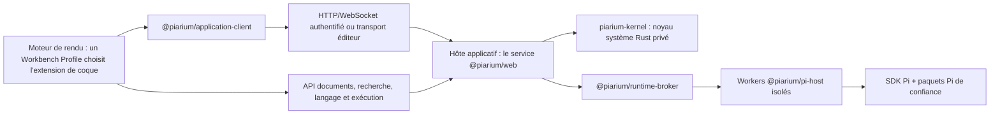

[English](../../README.md) | [简体中文](README.zh-CN.md) | [繁體中文](README.zh-TW.md) | Français | [日本語](README.ja.md)

# Piarium

<p align="center">
  <picture>
    <source media="(prefers-color-scheme: dark)" srcset="../../packages/web/public/logo-dark-512x512.svg" />
    
  </picture>
</p>

[](https://github.com/Youzini-afk/Piarium/actions/workflows/ci.yml)
[](https://github.com/Youzini-afk/Piarium/actions/workflows/docker.yml)
[](../../LICENSE)

**Un espace de travail Pi-natif et recomposable, doté d'un harness d'agent gouverné, pour les agents
de code : conçu pour le travail local, utilisable depuis le bureau, le web, les éditeurs et les
clients mobiles.**

Piarium transforme l'[agent de code Pi](https://github.com/earendil-works/pi) en un produit complet.
Pi reste le noyau de l'agent — pile de modèles et de fournisseurs, arbre de sessions, gestionnaire de
paquets et modèle d'extensions — tandis que Piarium possède tout ce qui l'entoure : l'environnement
d'outils, l'état de travail, la restauration, la recherche, la politique de contexte et la gouvernance
des tâches, ainsi que les surfaces de workbench dans lesquelles l'agent s'exécute. Il utilise
directement le SDK public de Pi plutôt que de parser une sortie de terminal.

Son interface n'est pas une coque figée. Piarium fournit deux formes de travail officielles : un
**Agent Workspace** centré sur les sessions, les tâches et le contexte, et un **IDE Workbench** centré
sur les éditeurs, la recherche, Git, les diagnostics et le débogage, avec l'agent comme panneau
ancrable. Les deux sont des extensions Piarium ordinaires sélectionnées par un Workbench Profile,
donc vous pouvez remplacer l'une ou l'autre, ou n'importe laquelle de leurs parties.

> [!IMPORTANT]
> Piarium est en pré-1.0 et en développement actif. Les surfaces produit et le protocole d'exécution
> privé avancent pour l'instant ensemble : rien ne garantit qu'une ancienne version interopère avec
> une plus récente. Sauvegardez les espaces de travail importants et épinglez un digest d'image
> testé pour les déploiements durables.

## Interfaces du produit

Les captures ci-dessous utilisent un `demo-workspace` isolé et des fichiers d'exemple anonymes.

### Agent Workspace

Les sessions et projets restent visibles tandis que la zone principale réunit l'agent actif, les
outils de contexte et le compositeur dans un même espace de travail.


### IDE Workbench

Le profil IDE associe la navigation et l'infrastructure d'édition à un agent Pi complet et ancré,
plutôt que de traiter le chat comme une application séparée.


### Espace de travail mobile

L'interface adaptative conserve le même projet, les contrôles de l'agent, les surfaces de contexte et
le compositeur sur un écran de téléphone.

<p align="center">
  
</p>

## Ce que fournit Piarium

### Un harness d'agent gouverné

- **Threads, runs et état de travail immuable :** le travail est organisé en threads et en runs dont
  les modifications de fichiers sont publiées sous forme de racines immuables. Les agents rédigent
  dans des espaces de travail virtuels ou matérialisés isolés, puis fusionnent les résultats relus,
  au lieu de modifier directement votre copie de travail.
- **Un seul portail de permissions :** une unique confirmation `tool_call` couvre les outils du
  harness, les outils Pi intégrés, les outils MCP, les outils de paquets et les outils des threads
  imbriqués. Les autorisations de session restent liées à l'outil, à l'action, à l'espace de
  travail, aux chemins et aux cibles réseau pour lesquels elles ont été approuvées.
- **Une restauration qui suit l'agent :** le service de restauration détenu par l'hôte journalise
  les mutations de l'agent avec vos propres modifications dans des points de contrôle communs, de
  sorte que le retour en arrière limité aux fichiers touchés, l'annulation/rétablissement et la
  reprise après incident fonctionnent à travers les appels d'outils sans analyser tout l'espace de
  travail.
- **Un environnement d'outils natif :** le superviseur de shell exécute de vrais PTY avec bascule
  automatique en arrière-plan, `get_output`, `write_to_process` et `kill_shell` ;
  `edit`/`write`/`apply_patch` emportent des diagnostics post-édition et des baux par chemin ; les
  résultats trop volumineux deviennent des `OutputRef` paginés ; et la sortie des gestionnaires de
  paquets est organisée au lieu d'être déversée brute.

### Contexte, recherche et connaissances

- **Assemblage structuré du contexte :** une couche Zone 2 injecte les faits observés de l'espace de
  travail — vos modifications, commandes de terminal, diagnostics, état Git — sans toucher au prompt
  système. Un memory keeper entretient la mémoire durable selon les modes off/assist/takeover, et la
  compaction côté hôte peut prendre en charge le résumé sans appels de modèle supplémentaires.
- **Recherche en couches :** `grep` pour la correspondance exacte, `explore`/`related` pour la
  découverte groupée adossée à un graphe de symboles et à la structure tree-sitter, et `recall`
  contre une base de connaissances par espace de travail, avec embeddings et reclassement
  facultatifs. Chaque couche est directement accessible ; aucune n'exige l'échec préalable d'une
  autre.
- **Outils web natifs :** `webfetch` avec politique SSRF et de domaines, extraction, PDF et cache ;
  `websearch` via des fournisseurs configurés par l'utilisateur ; un panneau de sources ; et le
  rendu de pages hors écran sur la surface bureau.

### Un véritable espace de travail de développement

- **Conversations Pi-natives :** streaming, branches, navigation dans l'arbre, compaction, files de
  pilotage et de messages de suivi, choix du modèle et du niveau de réflexion, renommage, archivage,
  restauration et suppression de sessions.
- **Outillage de l'espace de travail :** fichiers, diffs, Git, worktrees, terminaux, hôtes SSH,
  instances distantes, commentaires et contexte d'éditeur partagent la session Pi active et son
  espace de travail.
- **Une infrastructure de niveau éditeur :** une autorité de documents versionnée avec un vrai
  traitement des conflits ; les surfaces Agent et IDE de bureau/web partagent les modèles Monaco,
  les groupes d'éditeurs, la recherche dans l'espace de travail, des serveurs de langage détenus par
  l'hôte et des adaptateurs de débogage conformes au standard, tandis que les éditeurs mobiles et
  embarqués utilisent un adaptateur CodeMirror léger contre la même autorité. Les modifications de
  l'agent se réconcilient avec vos tampons non enregistrés au lieu de les écraser.
- **Fournisseurs personnalisés :** configurez les couches de fournisseurs Pi-natives,
  l'authentification, la découverte de modèles et les points de terminaison personnalisés sans
  recopier les identifiants dans le stockage du moteur de rendu.

### Recomposable et partout

- **Des paquets sans système de plugins parallèle :** installez, mettez à jour, supprimez et
  inspectez n'importe quel paquet accepté par le `PackageManager` de Pi. Les extensions sans
  adaptation dédiée bénéficient tout de même du traitement générique des commandes, outils, entrées,
  notifications et éléments d'interface.
- **Configuration de plugins de première classe :** les plugins maintenus disposent d'interfaces
  dédiées, tandis que leurs propres fichiers JSON/JSONC natifs, commandes, bases de données et
  logiques de migration restent la référence.
- **Un workbench recomposable :** choisissez le profil Agent ou IDE, ou construisez le vôtre.
  Remplacez la coque entière, ou seulement la navigation, l'éditeur, un panneau, le composeur, la
  timeline ou la barre d'état, et mélangez contributions officielles et communautaires. Le
  changement est immédiat, sans rechargement des documents, sans redémarrage de l'exécution Pi et
  sans perte de l'état partagé de l'espace de travail.
- **Plusieurs surfaces produit :** une interface React partagée alimente Electron, le web et la
  coque mobile Capacitor à travers des capacités d'exécution explicites, avec VS Code comme
  compagnon qui apporte le contexte de l'éditeur à Piarium plutôt qu'un second workbench.
- **Fonctionnement cloud et distant :** accès WebSocket authentifié, prise en charge des
  relais/tunnels, conteneurs multi-architectures et déploiement SSH atomique avec validation de
  santé et rollback.

## Intégrations d'extensions maintenues

Piarium ne fork pas ces extensions et ne recopie pas leur état privé. Les adaptateurs maintenus
consomment les commandes, événements, fichiers de configuration et contrats de capacités publics de
chaque extension — dont les flottes de sous-agents, les gestionnaires de contexte, l'historique d'espace de
travail, serveurs MCP, accès web, systèmes de mémoire, tâches en arrière-plan et configuration
LSP/outillage — ce qui permet à ces paquets de continuer à évoluer de leur côté.

La surface d'intégration de chaque adaptateur — les commandes, événements et fichiers de
configuration natifs qu'il lit ou invoque, et les fichiers qui restent détenus par le plugin — est
consignée dans [le contrat d'intégration des extensions](../../docs/extension-compatibility.md). Piarium
ne certifie pas les versions de plugins face aux versions de Pi.

## Développer des extensions Piarium

Les extensions applicatives Piarium et les paquets Pi sont deux objets produit distincts : les
premières étendent le workbench, les surfaces et l'hôte de confiance de Piarium, les seconds
s'exécutent à l'intérieur de l'agent Pi. La chaîne d'outils npm publique n'exige ni de récupérer les
sources de Piarium, ni d'importer l'interface privée du produit :

- `@piarium/extension-contract` : contrats de manifeste, de contribution, de service, de routage et
  de découverte, avec les schémas JSON ;
- `@piarium/extension-sdk` : API d'écriture Surface, realm isolé et Host, indépendantes du framework ;
- `@piarium/extension-react` : adaptateur React 19 facultatif ;
- `@piarium/extension-surface` : cycle de vie et registres bas niveau pour les tests avancés ou les
  hôtes alternatifs ;
- `@piarium/extension-cli` : initialisation de projet, validation, build et tests de conformité.

Créer un projet d'extension complet :

```sh
npx @piarium/extension-cli init ./my-extension --id dev.example.my-extension --name "My Extension"
cd my-extension
npm install
npx piarium-extension build
npx piarium-extension test
```

Les contrats complets de manifeste, de capacités, de cycle de vie, de stockage, de publication et de
test sont dans le [guide de développement d'extensions Piarium](../../docs/piarium-extension-authoring.md).

## Télécharger la version bureau

Les paquets de bureau pour Windows x64/ARM64, Linux x64/ARM64 et macOS Intel/Apple Silicon sont
publiés via les [GitHub Releases](https://github.com/Youzini-afk/Piarium/releases).

## Démarrer depuis les sources

### Prérequis

- Node.js 22.19 ou plus récent ; Node.js 24 est la base prise en charge pour le développement depuis
  les sources
- Bun 1.3.14
- Une chaîne d'outils Rust conforme à `kernel/rust-toolchain.toml` (rustup la sélectionne
  automatiquement)
- Git
- Git for Windows et Git Bash pour exécuter les outils shell de Pi sous Windows

Le noyau système Rust est un composant d'exécution obligatoire, pas un accélérateur facultatif. En
développement depuis les sources, l'hôte l'exécute via Cargo lorsqu'aucun binaire préparé n'est
présent ; `bun run kernel:build` produit l'exécutable de publication vérifié par manifeste qu'exigent
les configurations packagées.

Piarium embarque une exécution Pi intégrée et détecte les installations de Pi au niveau utilisateur
via le Runtime Manager, qui peut sélectionner, installer ou mettre à niveau Pi sans le rétrograder.
Piarium ne devient prêt qu'après une véritable poignée de main avec le Host, et n'a pas besoin de
redémarrer après activation. Electron contient l'exécution Node nécessaire à l'application, tandis
que Pi reste un outil géré indépendamment. Les paquets de bureau natifs x64/ARM64 pour Windows, Linux
et macOS sont validés sur des runners correspondants pour le démarrage de l'application, le Runtime
Manager, la santé et le cycle de vie du terminal ; les installeurs hors ligne facultatifs restent à
faire. Les conteneurs et l'extension VS Code conservent une exécution Pi épinglée et autonome, pour
une exécution reproductible sans surveillance et dans l'hôte éditeur.

### Lancer la surface de développement web

```bash
git clone https://github.com/Youzini-afk/Piarium.git
cd Piarium
bun install --frozen-lockfile
bun run dev
```

Ouvrez l'URL Vite affichée dans le terminal. Piarium choisit des ports de développement disponibles
et démarre le service API/exécution de confiance en même temps que l'interface.

### Lancer l'application de bureau

```bash
bun run electron:dev
```

Utilisez le chemin des ressources embarquées pour tester un comportement plus proche d'un build
packagé :

```bash
bun run electron:dev:bundled
```

### Construire un installeur Windows

À exécuter sous Windows :

```powershell
bun run electron:build:win
bun run electron:smoke:win
```

L'installeur NSIS, les métadonnées de mise à jour et le blockmap sont écrits dans
`packages/electron/dist`. Sans identifiants de signature de code, l'installeur est délibérément non
signé. Voir le [guide de packaging bureau](../../packages/electron/README.md#packaging) pour la signature
et les détails par plateforme.

## Lancer l'image cloud

Le fichier Compose utilise par défaut l'image allégée
`ghcr.io/youzini-afk/piarium-slim:latest`. Sur un hôte Docker Linux :

```bash
mkdir -p data/piarium data/ssh data/cloudflared workspaces
sudo chown -R 1000:1000 data workspaces
umask 077
printf 'PIARIUM_UI_PASSWORD=%s\n' "$(openssl rand -base64 24)" > .env
docker compose up -d
curl --fail http://127.0.0.1:3000/health
```

Ouvrez `http://127.0.0.1:3000` et utilisez le mot de passe généré. Placez un reverse proxy TLS ou un
tunnel approuvé devant tout déploiement exposé à Internet ; voir
[la configuration du reverse proxy](../../docs/REVERSE_PROXY.md) pour les règles de transfert
nécessaires. En production, fixez `PIARIUM_IMAGE` à un digest immuable testé plutôt que de compter
sur un tag flottant.

Si l'agent doit compiler du Python, Java, Go ou Rust dans le conteneur, appliquez la surcouche
toolbelt :

```bash
docker compose -f docker-compose.yml -f docker-compose.toolbelt.yml up -d
```

Les images sont publiées pour `linux/amd64` et `linux/arm64`, avec attestations de provenance et
SBOM. Le contrat complet des chemins persistants, de l'environnement, des conteneurs et du rollback
SSH est documenté dans [Déploiement cloud](../../docs/cloud-deployment.md).

## Architecture



L'hôte applicatif est le seul backend de confiance. Chaque hôte possède un processus enfant
`piarium-kernel` privé qui constitue l'autorité de production pour les ressources durables et proches
de la machine : racines d'état de travail immuables, objets de contenu et GC, métadonnées de
restauration, ressources de fichiers canoniques et matérialisation, arbres de processus PTY et pipes,
et calcul de fichiers et de structure sur vue figée. L'hôte conserve la politique produit — admission
des acteurs, coordination des documents, cycle de vie des threads et des runs, connaissances et
orchestration des modèles — et dialogue avec le noyau via un protocole stdio à trames privé, jamais
un port public. Chaque ressource n'a qu'un seul rédacteur de production ; aucune autorité de repli
TypeScript ne subsiste derrière le noyau.

Le broker possède un worker de catalogue et un worker par session. Recharger le moteur de rendu
n'interrompt pas une tâche active, et la défaillance d'un worker Pi ne fait pas tomber le moteur de
rendu. Seuls les DTO du protocole franchissent la frontière de processus ; les callbacks du SDK, les
objets d'identifiants et les détails d'implémentation des extensions ne la franchissent pas.

Electron exécute ce même hôte dans son processus principal au lieu d'ajouter un backend bureau
parallèle ; seules les capacités réellement natives, comme les fenêtres, les menus et les boîtes de
dialogue, franchissent la frontière du preload Electron.

Les paquets Pi tiers sont du code exécutable disposant des permissions système de l'utilisateur.
Piarium affiche les capacités observées et conditionne l'accès aux ressources exécutables locales au
projet, mais il ne prétend pas transformer des extensions de confiance en bac à sable complet. Lisez
la [politique de sécurité](../../.github/SECURITY.md) et le [modèle de sécurité](../../docs/security.md) avant
d'exposer une instance distante ou d'installer du code inconnu.

## Organisation du dépôt

| Chemin | Responsabilité |
| --- | --- |
| `kernel/` | Noyau système Rust privé : état de travail, ressources fichiers, processus et calcul |
| `packages/application-client` | `RuntimeAPIs` indépendantes du framework, transports, erreurs typées et contrat IPC bureau |
| `packages/ui` | Interface React Pi-native partagée, stores, réglages et surfaces d'extension |
| `packages/web` | Frontend navigateur/distant, hôte applicatif de confiance et CLI cloud |
| `packages/electron` | Coque bureau native, frontière privilégiée, packaging, SSH et mises à jour |
| `packages/vscode` | Hôte d'extension VS Code, webview et pont d'exécution |
| `packages/mobile` | Coque Capacitor iOS/Android connectée à un serveur Piarium |
| `packages/protocol` | Protocole worker et surface versionné, sûr en JSON |
| `packages/runtime-client` | Client de requêtes/événements d'exécution utilisable en navigateur |
| `packages/runtime-broker` | Possession, routage et arrêt des workers de catalogue et de session |
| `packages/pi-host` | Worker Node isolé embarquant le SDK Pi et les extensions |
| `packages/settings-store` | Persistance atomique des fichiers de réglages partagée par les hôtes |
| `packages/extension-contract` | Contrats de manifeste, contribution, workbench, service et découverte |
| `packages/extension-surface` | Portées de possession indépendantes du framework et registres Surface transactionnels |
| `packages/extension-sdk`, `-react`, `-cli` | SDK public d'écriture, adaptateur React et outillage auteur |
| `packages/extension-host` | Catalogue, artefacts, stockage et services de l'hôte applicatif de confiance |
| `packages/extension-loader` | Chargeur de modules Surface managés authentifié et realms isolés |
| `packages/extension-builtins` | Manifestes des extensions intégrées à Piarium, dont les deux coques |
| `packages/docs` | Sources du site de documentation destiné aux utilisateurs |
| `docs` | Contrats d'architecture, de harness, de noyau, de workbench, de migration, de restauration, de cloud et de sécurité |
| `scripts` | Outillage de développement, build/mesure du noyau, publication, cloud, déploiement et validation |

## Développement et validation

Les scripts `package.json` de la racine ou des paquets font référence pour les commandes. La base
locale suivante correspond aux principales barrières de CI :

```bash
bun install --frozen-lockfile
bun run type-check
bun run lint
bun run test:pi
bun run test:kernel
bun run test:cloud
bun run build
bun run test:pi:dist
```

`bun run kernel:check` est la vérification de compilation Rust rapide ; `bun run test:kernel` exécute
la suite d'autorité native non ignorant contre l'exécutable de publication construit.
`bun run test:docs` et `bun run docs:validate` vérifient respectivement la documentation d'ingénierie
et le contenu du site de documentation.

La CI expose trois barrières stables aux responsabilités distinctes : qualité des sources sous
Ubuntu, comportement d'exécution sous Windows et build de production sous Ubuntu. La vérification de
types, le lint et l'ensemble des tests de l'espace de travail s'exécutent une seule fois dans leur
barrière de référence ; Windows n'ajoute que la couverture sensible à la plateforme. Quand les
entrées cloud/exécution changent, le workflow Docker vérifie le contrat de conteneur, construit les
images de base et applicatives allégée et toolbelt associées, teste les deux applications par digest
immuable, et ne promeut les tags qu'après le passage des deux candidates.

Avant de contribuer, lisez [le guide d'ingénierie](../../docs/development.md),
[CONTRIBUTING.md](../../.github/CONTRIBUTING.md) et les règles propres au dépôt dans
[AGENTS.md](../../AGENTS.md).

## Documentation de conception et d'exploitation

- [Architecture](../../docs/architecture.md)
- [Guide d'ingénierie](../../docs/development.md)
- [Feuille de route](../../docs/roadmap.md)
- [Contrat du harness d'agent](../../docs/agent-harness.md) (en chinois simplifié), avec [l'état de livraison](../../docs/agent-harness-status.md), [le plan](../../docs/agent-harness-plan.md) et [le journal des décisions](../../docs/agent-harness-decisions.md)
- [Conception du noyau système Rust](../../docs/rust-kernel-design.md) et [compte rendu d'audit](../../docs/rust-kernel-audit.md)
- [Contrat du workbench composable et de l'IDE](../../docs/composable-workbench.md) (en chinois simplifié)
- [Plateforme d'éditeur de fichiers unifié](../../docs/unified-file-editor-platform.md)
- [Plateforme d'extensions Piarium](../../docs/piarium-extension-platform.md)
- [Migration vers le compagnon VS Code](../../docs/vscode-companion.md)
- [Contrat de migration d'OpenChamber vers Pi](../../docs/openchamber-pi-migration.md)
- [Conception de l'interface et de la possession des plugins](../../docs/plugin-gui-design.md)
- [Modèle de restauration](../../docs/recovery.md)
- [Déploiement cloud](../../docs/cloud-deployment.md)
- [Modèle de sécurité](../../docs/security.md)

## Filiation et licence

Piarium est une refonte Pi-native du fork OpenChamber du mainteneur.

Piarium, en tant qu'œuvre combinée, est distribué sous la
[GNU Affero General Public License v3.0](../../LICENSE) (`AGPL-3.0-only`). Les versions modifiées proposées
à des utilisateurs via un réseau doivent rendre disponible le code source correspondant, comme
l'exige la licence.
