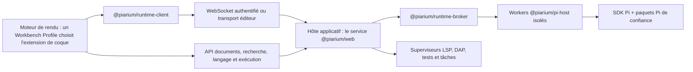

[简体中文](../../README.md) | [繁體中文](README.zh-TW.md) | [English](README.en.md) | Français | [日本語](README.ja.md)

# Piarium

<p align="center">
  <picture>
    <source media="(prefers-color-scheme: dark)" srcset="../../packages/web/public/logo-dark-512x512.svg" />
    
  </picture>
</p>

[](https://github.com/Youzini-afk/Piarium/actions/workflows/ci.yml)
[](https://github.com/Youzini-afk/Piarium/actions/workflows/docker.yml)
[](../../LICENSE)

**Un espace de travail Pi-natif et recomposable pour les agents de code : conçu pour le travail local,
utilisable depuis le bureau, le web, les éditeurs et les clients mobiles.**

Piarium transforme l'[agent de code Pi](https://github.com/earendil-works/pi) en un espace de travail
complet. Il utilise directement le SDK public de Pi, son arbre de sessions, son gestionnaire de
paquets et son modèle d'extensions : aucun parsing de sortie de terminal, aucune couche de
compatibilité OpenCode permanente.

Son interface n'est pas une coque figée. Piarium fournit deux formes de travail officielles : un
**Agent Workspace** centré sur les sessions, les tâches et le contexte, et un **IDE Workbench** centré
sur les éditeurs, la recherche, Git, les diagnostics et le débogage, avec l'agent comme panneau
ancrable. Les deux sont des extensions Piarium ordinaires sélectionnées par un Workbench Profile,
donc vous pouvez remplacer l'une ou l'autre, ou n'importe laquelle de leurs parties.

> [!IMPORTANT]
> Piarium est en pré-1.0 et en développement actif. Les surfaces produit et le protocole d'exécution
> privé avancent pour l'instant ensemble : rien ne garantit qu'une ancienne version interopère avec
> une plus récente. Sauvegardez les espaces de travail importants et épinglez un digest d'image
> testé pour les déploiements durables.

## Ce que fournit Piarium

- **Conversations Pi-natives :** streaming, branches, navigation dans l'arbre, compaction, files de
  pilotage et de messages de suivi, choix du modèle et du niveau de réflexion, renommage, archivage,
  restauration et suppression de sessions.
- **Un véritable espace de travail de développement :** fichiers, diffs, Git, worktrees, terminaux,
  hôtes SSH, instances distantes, commentaires et contexte d'éditeur partagent la session Pi active
  et son espace de travail.
- **Des paquets sans système de plugins parallèle :** installez, mettez à jour, supprimez et
  inspectez n'importe quel paquet accepté par le `PackageManager` de Pi. Les extensions sans
  adaptation dédiée bénéficient tout de même du traitement générique des commandes, outils, entrées,
  notifications et éléments d'interface.
- **Configuration de plugins de première classe :** les plugins maintenus disposent d'interfaces
  dédiées, tandis que leurs propres fichiers JSON/JSONC natifs, commandes, bases de données et
  logiques de migration restent la référence.
- **Restauration déléguée aux plugins :** le retour en arrière d'une conversation suit l'arbre de
  sessions en ajout seul de Pi ; la restauration conversation + fichiers, les points de contrôle,
  l'annulation/rétablissement et la réparation de prompt sont délégués aux plugins qui détiennent
  réellement cet historique.
- **Fournisseurs personnalisés :** configurez les couches de fournisseurs Pi-natives,
  l'authentification, la découverte de modèles et les points de terminaison personnalisés sans
  recopier les identifiants dans le stockage du moteur de rendu.
- **Un workbench recomposable :** choisissez le profil Agent ou IDE, ou construisez le vôtre.
  Remplacez la coque entière, ou seulement la navigation, l'éditeur, un panneau, le composeur, la
  timeline ou la barre d'état, et mélangez contributions officielles et communautaires. Le
  changement est immédiat, sans rechargement des documents, sans redémarrage de l'exécution Pi et
  sans perte de l'état partagé de l'espace de travail.
- **Une infrastructure de niveau éditeur :** une autorité de documents versionnée avec un vrai
  traitement des conflits, des groupes d'éditeurs partagés sur CodeMirror 6, la recherche dans
  l'espace de travail, des serveurs de langage détenus par l'hôte et un adaptateur de débogage
  conforme au standard. Les modifications de l'agent se réconcilient avec vos tampons non
  enregistrés au lieu de les écraser.
- **Plusieurs surfaces produit :** une interface React partagée alimente Electron, le web et la
  coque mobile Capacitor à travers des capacités d'exécution explicites, avec VS Code comme
  compagnon qui apporte le contexte de l'éditeur à Piarium plutôt qu'un second workbench.
- **Fonctionnement cloud et distant :** accès WebSocket authentifié, prise en charge des
  relais/tunnels, conteneurs multi-architectures et déploiement SSH atomique avec validation de
  santé et rollback.

## Intégrations d'extensions maintenues

Piarium ne fork pas ces extensions et ne recopie pas leur état privé. Il consomme leurs commandes Pi
publiques, leurs événements, leurs fichiers de configuration et leurs contrats de capacités, ce qui
permet à ces paquets de continuer à évoluer de leur côté.

| Extension | Intégration Piarium |
| --- | --- |
| `pi-subagents` | Projections et contrôles Fleet/tâches via le RPC public et les commandes de l'extension |
| `@cortexkit/pi-magic-context` | Configuration JSONC natives utilisateur/projet, commandes enregistrées, état et entrées publiques |
| `pi-workspace-history` | Restauration conjointe conversation/espace de travail, annulation, rétablissement et points de contrôle nommés |
| `pi-wtf` | Actions de réparation de prompt et configuration `wtf.json` détenue par l'extension |
| `pi-mcp-adapter` | Catalogue de serveurs effectif détenu par l'adaptateur, état et actions publics, édition versionnée de la source native |
| `pi-web-access` | `web-search.json` natif, actions Curator et compte, navigation dans les résultats enregistrés |
| `pi-openai-codex-compat` | Configuration native globale/projet des requêtes, du raisonnement, de la compaction distante et des outils Codex |
| `pi-observational-memory` | Configuration native globale/projet de l'observation, de la réflexion, de la compaction, du pool et des workers |
| `context-mode` | Paquet Pi natif recommandé, avec configuration de plugin générique faute de document de réglages canonique unique |
| `pi-lens` | Configuration native utilisateur/projet le plus proche, contrôles de diagnostic et de formatage, actions de commandes enregistrées |
| `@cortexkit/aft-pi` | JSONC natif utilisateur/projet pour l'édition, la recherche, l'analyse sémantique, le LSP, la sauvegarde et le bac à sable |
| `@gotgenes/pi-permission-system` | Politique de permissions native globale/projet, contrôles de l'interface d'exécution et disponibilité des commandes |
| `pi-hermes-memory` | Configuration native de la politique mémoire, de la revue en arrière-plan, du vidage, de la capacité, du rappel et des surcharges de modèle |
| `pi-background-tasks` | Visibilité Fleet, lancement, journaux bornés et arrêt via le contrat EventBus public |
| `pi-rtk-optimizer` | Configuration native en JSON strict de la réécriture RTK, de la sortie, de la lecture et de la troncature, plus la disponibilité des commandes |

La surface d'intégration de chaque adaptateur — les commandes, événements et fichiers de
configuration natifs qu'il lit ou invoque, et les fichiers qui restent détenus par le plugin — est
consignée dans [le contrat d'intégration des extensions](../../docs/extension-compatibility.md). Piarium
ne certifie pas les versions de plugins face aux versions de Pi.

## Développer des extensions Piarium

Les extensions applicatives Piarium et les paquets Pi sont deux objets produit distincts : les
premières étendent le workbench, les surfaces et l'hôte de confiance de Piarium, les seconds
s'exécutent à l'intérieur de l'agent Pi. La chaîne d'outils npm publique n'exige ni de récupérer les
sources de Piarium, ni d'importer l'interface privée du produit :

- `@piarium/extension-contract` : contrats de manifeste, de contribution, de service, de routage et
  de découverte, avec les schémas JSON ;
- `@piarium/extension-sdk` : API d'écriture Surface, realm isolé et Host, indépendantes du framework ;
- `@piarium/extension-react` : adaptateur React 19 facultatif ;
- `@piarium/extension-surface` : cycle de vie et registres bas niveau pour les tests avancés ou les
  hôtes alternatifs ;
- `@piarium/extension-cli` : initialisation de projet, validation, build et tests de conformité.

Créer un projet d'extension complet :

```sh
npx @piarium/extension-cli init ./my-extension --id dev.example.my-extension --name "My Extension"
cd my-extension
npm install
npx piarium-extension build
npx piarium-extension test
```

Les contrats complets de manifeste, de capacités, de cycle de vie, de stockage, de publication et de
test sont dans le [guide de développement d'extensions Piarium](../../docs/piarium-extension-authoring.md).

## Télécharger la version bureau

Les paquets de bureau pour Windows x64/ARM64, Linux x64/ARM64 et macOS Intel/Apple Silicon sont
publiés via les [GitHub Releases](https://github.com/Youzini-afk/Piarium/releases).

## Démarrer depuis les sources

### Prérequis

- Node.js 22.19 ou plus récent ; Node.js 24 est la base prise en charge pour le développement depuis
  les sources
- Bun 1.3.14
- Git
- Git for Windows et Git Bash pour exécuter les outils shell de Pi sous Windows

La version bureau n'embarque plus le SDK Pi de façon permanente. Elle détecte d'abord une
installation de Pi au niveau utilisateur, puis le flux Pi Runtime permet de sélectionner, installer
ou mettre à niveau Pi sans le rétrograder. Piarium ne devient prêt qu'après une véritable poignée de
main avec le Host, et n'a pas besoin de redémarrer après activation. Electron contient l'exécution
Node nécessaire à l'application, tandis que Pi reste un outil géré indépendamment au niveau
utilisateur. Les paquets de bureau natifs x64/ARM64 pour Windows, Linux et macOS sont validés sur
des runners correspondants pour le démarrage de l'application, le Runtime Manager, la santé et le
cycle de vie du terminal ; les installeurs hors ligne facultatifs restent à faire. Les conteneurs et
l'extension VS Code conservent une exécution Pi épinglée et autonome, pour une exécution
reproductible sans surveillance et dans l'hôte éditeur.

### Lancer la surface de développement web

```bash
git clone https://github.com/Youzini-afk/Piarium.git
cd Piarium
bun install --frozen-lockfile
bun run dev
```

Ouvrez l'URL Vite affichée dans le terminal. Piarium choisit des ports de développement disponibles
et démarre le service API/exécution de confiance en même temps que l'interface.

### Lancer l'application de bureau

```bash
bun run electron:dev
```

Utilisez le chemin des ressources embarquées pour tester un comportement plus proche d'un build
packagé :

```bash
bun run electron:dev:bundled
```

### Construire un installeur Windows

À exécuter sous Windows :

```powershell
bun run electron:build:win
bun run electron:smoke:win
```

L'installeur NSIS, les métadonnées de mise à jour et le blockmap sont écrits dans
`packages/electron/dist`. Sans identifiants de signature de code, l'installeur est délibérément non
signé. Voir le [guide de packaging bureau](../../packages/electron/README.md#packaging) pour la signature
et les détails par plateforme.

## Lancer l'image cloud

Le fichier Compose utilise par défaut l'image allégée
`ghcr.io/youzini-afk/piarium-slim:latest`. Sur un hôte Docker Linux :

```bash
mkdir -p data/piarium data/ssh data/cloudflared workspaces
sudo chown -R 1000:1000 data workspaces
umask 077
printf 'PIARIUM_UI_PASSWORD=%s\n' "$(openssl rand -base64 24)" > .env
docker compose up -d
curl --fail http://127.0.0.1:3000/health
```

Ouvrez `http://127.0.0.1:3000` et utilisez le mot de passe généré. Placez un reverse proxy TLS ou un
tunnel approuvé devant tout déploiement exposé à Internet ; voir
[la configuration du reverse proxy](../../docs/REVERSE_PROXY.md) pour les règles de transfert
nécessaires. En production, fixez `PIARIUM_IMAGE` à un digest immuable testé plutôt que de compter
sur un tag flottant.

Si l'agent doit compiler du Python, Java, Go ou Rust dans le conteneur, appliquez la surcouche
toolbelt :

```bash
docker compose -f docker-compose.yml -f docker-compose.toolbelt.yml up -d
```

Les images sont publiées pour `linux/amd64` et `linux/arm64`, avec attestations de provenance et
SBOM. Le contrat complet des chemins persistants, de l'environnement, des conteneurs et du rollback
SSH est documenté dans [Déploiement cloud](../../docs/cloud-deployment.md).

## Architecture



Le broker possède un worker de catalogue et un worker par session. Recharger le moteur de rendu
n'interrompt pas une tâche active, et la défaillance d'un worker Pi ne fait pas tomber le moteur de
rendu. Seuls les DTO du protocole franchissent la frontière de processus ; les callbacks du SDK, les
objets d'identifiants et les détails d'implémentation des extensions ne la franchissent pas.

L'hôte applicatif est le seul backend de confiance. Il possède l'autorité de documents versionnée, la
recherche dans l'espace de travail, les serveurs de langage et les processus de débogage, de test et
de tâches ; les moteurs de rendu envoient donc des requêtes typées et ne démarrent jamais de
processus. Electron exécute ce même hôte dans son processus principal au lieu d'ajouter un backend
bureau parallèle ; seules les capacités réellement natives, comme les fenêtres, les menus et les
boîtes de dialogue, franchissent la frontière du preload Electron.

Les paquets Pi tiers sont du code exécutable disposant des permissions système de l'utilisateur.
Piarium affiche les capacités observées et conditionne l'accès aux ressources exécutables locales au
projet, mais il ne prétend pas transformer des extensions de confiance en bac à sable complet. Lisez
la [politique de sécurité](../../.github/SECURITY.en.md) et le [modèle de sécurité](../../docs/security.md) avant
d'exposer une instance distante ou d'installer du code inconnu.

## Organisation du dépôt

| Chemin | Responsabilité |
| --- | --- |
| `packages/ui` | Interface React Pi-native partagée, stores, réglages et surfaces d'extension |
| `packages/web` | Frontend navigateur/distant, service HTTP/WebSocket et CLI cloud |
| `packages/electron` | Coque bureau native, frontière privilégiée, packaging, SSH et mises à jour |
| `packages/vscode` | Hôte d'extension VS Code, webview et pont d'exécution |
| `packages/mobile` | Coque Capacitor iOS/Android connectée à un serveur Piarium |
| `packages/protocol` | Protocole worker et surface versionné, sûr en JSON |
| `packages/runtime-client` | Client de requêtes/événements d'exécution utilisable en navigateur |
| `packages/runtime-broker` | Possession, routage et arrêt des workers de catalogue et de session |
| `packages/pi-host` | Worker Node isolé embarquant le SDK Pi et les extensions |
| `packages/extension-contract` | Contrats de manifeste, contribution, workbench, service et découverte |
| `packages/extension-surface` | Portées de possession indépendantes du framework et registres Surface transactionnels |
| `packages/extension-sdk`, `-react`, `-cli` | SDK public d'écriture, adaptateur React et outillage auteur |
| `packages/extension-host` | Catalogue, artefacts, stockage et services de l'hôte applicatif de confiance |
| `packages/extension-loader` | Chargeur de modules Surface managés authentifié et realms isolés |
| `packages/extension-builtins` | Manifestes des extensions intégrées à Piarium, dont les deux coques |
| `packages/docs` | Sources du site de documentation destiné aux utilisateurs |
| `docs` | Contrats d'architecture, workbench, migration, restauration, plugins, cloud et sécurité |
| `scripts` | Outillage de développement, publication, build cloud, déploiement et validation |

## Développement et validation

Les scripts `package.json` de la racine ou des paquets font référence pour les commandes. La base
locale suivante correspond aux principales barrières de CI :

```bash
bun install --frozen-lockfile
bun run type-check
bun run lint
bun run test:pi
bun run test:cloud
bun run build
bun run test:pi:dist
```

La CI expose trois barrières stables aux responsabilités distinctes : qualité des sources sous
Ubuntu, comportement d'exécution sous Windows et build de production sous Ubuntu. La vérification de
types, le lint et l'ensemble des tests de l'espace de travail s'exécutent une seule fois dans leur
barrière de référence ; Windows n'ajoute que la couverture sensible à la plateforme. Quand les
entrées cloud/exécution changent, le workflow Docker vérifie le contrat de conteneur, construit les
images de base et applicatives allégée et toolbelt associées, teste les deux applications par digest
immuable, et ne promeut les tags qu'après le passage des deux candidates.

Avant de contribuer, lisez [CONTRIBUTING.en.md](../../.github/CONTRIBUTING.en.md) et les règles propres au
dépôt dans [AGENTS.md](../../AGENTS.md).

## Documentation de conception et d'exploitation

- [Architecture](../../docs/architecture.md)
- [Feuille de route](../../docs/roadmap.md)
- [Contrat du workbench composable et de l'IDE](../../docs/composable-workbench-execution-plan.md) (en chinois simplifié)
- [Plateforme d'extensions Piarium](../../docs/piarium-extension-platform.md)
- [Migration vers le compagnon VS Code](../../docs/vscode-companion.md)
- [Contrat de migration d'OpenChamber vers Pi](../../docs/openchamber-pi-migration.md)
- [Conception de l'interface et de la possession des plugins](../../docs/plugin-gui-design.md)
- [Modèle de restauration](../../docs/recovery.md)
- [Déploiement cloud](../../docs/cloud-deployment.md)
- [Modèle de sécurité](../../docs/security.md)

## Filiation et licence

Piarium est une refonte Pi-native directe du fork OpenChamber du mainteneur. Ce fork est la filiation
produit et interface, pas une dépendance d'exécution : les processus, clients, schémas et chemins de
compatibilité OpenCode devenus obsolètes sont supprimés à mesure que leurs remplacements Pi-natifs
deviennent la référence.

Piarium, en tant qu'œuvre combinée, est distribué sous la
[GNU Affero General Public License v3.0](../../LICENSE) (`AGPL-3.0-only`). Les versions modifiées proposées
à des utilisateurs via un réseau doivent rendre disponible le code source correspondant, comme
l'exige la licence.

Les éléments importés sous licence permissive restent soumis à leurs mentions d'origine ; conserver
ces mentions ne rend pas Piarium disponible dans son ensemble sous licence MIT. Voir les
[mentions de tiers](../../THIRD_PARTY_NOTICES.md). Pi et les paquets Pi tiers sont des projets indépendants
distribués sous leurs propres licences.
