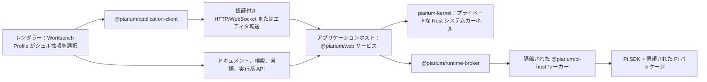

[English](../../README.md) | [简体中文](README.zh-CN.md) | [繁體中文](README.zh-TW.md) | [Français](README.fr.md) | 日本語

# Piarium

<p align="center">
  <picture>
    <source media="(prefers-color-scheme: dark)" srcset="../../packages/web/public/logo-dark-512x512.svg" />
    
  </picture>
</p>

[](https://github.com/Youzini-afk/Piarium/actions/workflows/ci.yml)
[](https://github.com/Youzini-afk/Piarium/actions/workflows/docker.yml)
[](../../LICENSE)

**コーディングエージェントのための、Pi ネイティブで再構成可能なワークスペースと統制されたエージェント
ハーネス。ローカル作業を中心に据えつつ、デスクトップ、Web、エディタ、モバイルのいずれからも使えます。**

Piarium は [Pi コーディングエージェント](https://github.com/earendil-works/pi)を、製品として完成した
ものに拡張します。Pi はエージェントカーネルであり続けます——モデル/プロバイダースタック、セッション
ツリー、パッケージマネージャー、拡張モデル——一方で Piarium はその周囲のすべてを所有します。ツール
環境、ワーキングステート、リカバリ、検索、コンテキストポリシー、タスクガバナンス、そしてエージェントが
動作するワークベンチ画面です。Pi の公開 SDK をそのまま使うため、ターミナル出力のスクレイピングも、
恒久的な OpenCode 互換レイヤーもありません。

その UI は固定されたシェルではありません。Piarium には 2 つの公式ワークスタイルが同梱されています。
セッション、タスク、コンテキストを中心に据えた **Agent Workspace** と、エディタ、検索、Git、診断、
デバッグを中心に据え、エージェントをドッキング可能なパネルとして扱う **IDE Workbench** です。どちらも
Workbench Profile によって選択される通常の Piarium 拡張なので、どちらか一方を丸ごと置き換えることも、
その一部だけを置き換えることもできます。

> [!IMPORTANT]
> Piarium は 1.0 前で、活発に開発中です。各プロダクトサーフェスとプライベートなランタイムプロトコルは
> いまのところ同時に進むため、古いビルドが新しいビルドと相互運用できる保証はありません。重要な
> ワークスペースはバックアップし、継続的なデプロイでは検証済みのイメージダイジェストに固定してください。

## プロダクト画面

以下のスクリーンショットは、個人のアカウント、実プロジェクト、会話、認証情報を含まない、隔離された
`demo-workspace` と匿名のサンプルファイルから生成しています。

### Agent Workspace

セッションとプロジェクトを常に表示しながら、アクティブなエージェント、コンテキストツール、入力欄を
一つの集中したワークスペースにまとめます。


### IDE Workbench

IDE プロファイルは、ワークスペースのナビゲーションとエディタ基盤を、ドッキングされた完全な Pi
エージェントと組み合わせます。チャットを別アプリとして切り離しません。


### モバイルワークスペース

レスポンシブな画面でも、同じプロジェクト、エージェント操作、コンテキスト画面、入力欄を利用できます。

<p align="center">
  
</p>

## Piarium が提供するもの

### 統制されたエージェントハーネス

- **Thread、Run、そして不変のワーキングステート：** 作業は Thread と Run に整理され、そのファイル
  変更は不変のルートとして公開されます。エージェントは隔離された仮想または実体化ワークスペースで
  下書きし、レビュー済みの結果をマージして戻します。チェックアウトへ無秩序に書き込むことは
  ありません。
- **単一の権限ゲート：** 1 つの `tool_call` 確認が、ハーネスツール、Pi 組み込みツール、MCP ツール、
  パッケージツール、ネストしたスレッドのツールをすべてカバーします。セッション許可は、承認された
  ツール、アクション、ワークスペース、パス、ネットワーク対象にスコープされたままです。
- **エージェントに追随するリカバリ：** Host 所有のリカバリサービスが、エージェントの変更とあなた
  自身の編集を共通のチェックポイントに記録するため、影響ファイルのロールバック、アンドゥ/リドゥ、
  クラッシュリカバリが、ワークスペース全体をスキャンせずにツール呼び出しをまたいで機能します。
- **ネイティブなツール環境：** シェルスーパーバイザーは実際の PTY を実行し、自動バックグラウンド
  移行、`get_output`、`write_to_process`、`kill_shell` を備えます。`edit`/`write`/`apply_patch`
  には編集後診断とパス単位のリースが付き、大きすぎる結果はページング可能な `OutputRef` になり、
  パッケージマネージャーの出力は生のまま流されるのではなく整理されます。

### コンテキスト、検索、ナレッジ

- **構造化されたコンテキスト組み立て：** Zone 2 レイヤーが、観測されたワークスペースの事実——
  あなたの編集、ターミナルコマンド、診断、Git ステータス——をシステムプロンプトに触れずに注入
  します。memory keeper は off/assist/takeover の各モードで永続メモリを保守し、Host 側の
  コンパクションは追加のモデル呼び出しなしで要約を引き継げます。
- **階層化された検索：** 完全一致には `grep`、シンボルグラフと tree-sitter 構造に裏付けられた
  グループ化された発見には `explore`/`related`、ワークスペースごとのナレッジストアへの永続メモリ
  検索には `recall` を使い、埋め込みとリランキングも任意で利用できます。各レイヤーは直接到達可能で、
  上位レイヤーの失敗を待つ必要はありません。
- **ネイティブな Web ツール：** SSRF・ドメインポリシー付きの `webfetch`、本文抽出、PDF、キャッシュ。
  ユーザー設定のプロバイダー経由の `websearch`。ソースパネル。デスクトップではオフスクリーンの
  ページレンダリング。

### 本物のコーディングワークスペース

- **Pi ネイティブな会話：** ストリーミング、分岐、ツリー移動、コンパクション、ステアリングと
  フォローアップキュー、モデルと思考レベルの選択、セッションの名前変更、アーカイブ、復元、削除。
- **ワークスペースのツール群：** ファイル、差分、Git、ワークツリー、ターミナル、SSH ホスト、
  リモートインスタンス、コメント、エディタコンテキストが、アクティブな Pi セッションと
  ワークスペースを共有します。
- **エディタ級の基盤：** バージョン管理された単一のドキュメント権威と本物のコンフリクト処理。
  デスクトップ/Web の Agent と IDE 画面は Monaco モデル、エディタグループ、ワークスペース検索、
  ホスト所有の言語サーバー、標準準拠のデバッグアダプタを共有し、モバイル/組み込みエディタは
  軽量な CodeMirror アダプタで同じ権威に接続します。エージェントの編集は、未保存のバッファを
  上書きするのではなく調整します。
- **カスタムプロバイダー：** Pi ネイティブなプロバイダー階層、認証、モデル検出、カスタム
  エンドポイントを、認証情報をレンダラーストレージへ複製せずに設定できます。

### 再構成可能で、どこにでも

- **並行するプラグインシステムを持たないパッケージ：** Pi の `PackageManager` が受け入れる任意の
  パッケージをインストール、更新、削除、検査できます。専用対応のない拡張にも、汎用のコマンド、
  ツール、エントリ、通知、UI ハンドリングが提供されます。
- **ファーストクラスのプラグイン設定：** 保守対象のプラグインには専用の GUI 画面があり、
  プラグイン自身のネイティブな JSON/JSONC ファイル、コマンド、データベース、マイグレーション
  ロジックは権威であり続けます。
- **再構成可能なワークベンチ：** Agent または IDE プロファイルを選ぶか、自分で構築します。
  シェル全体を置き換えることも、ナビゲーション、エディタ、パネル、コンポーザー、タイムライン、
  ステータスバーだけを置き換えることもでき、公式とコミュニティの貢献を混在させられます。
  切り替えはライブで行われ、ドキュメントの再読み込み、Pi ランタイムの再起動、共有ワークスペース
  状態の喪失はありません。
- **複数のプロダクト画面：** 共有の React UI が、明示的なランタイムケイパビリティを通じて
  Electron、Web、Capacitor モバイルシェルを駆動します。VS Code はエディタコンテキストを Piarium
  へ持ち込むコンパニオンであり、第 2 のワークベンチではありません。
- **クラウドとリモート運用：** 認証付き WebSocket アクセス、リレー/トンネル対応、マルチ
  アーキテクチャコンテナ、ヘルス検証とロールバックを備えたアトミックな SSH デプロイ。

## 保守対象の拡張インテグレーション

Piarium はこれらの拡張をフォークせず、プライベートな状態を複製しません。保守対象のアダプタは、
各拡張の公開コマンド、イベント、設定ファイル、ケイパビリティ契約だけを消費します。対象は
サブエージェントフリート、コンテキスト管理、ワークスペース履歴、MCP サーバー、Web アクセス、
メモリシステム、バックグラウンドタスク、LSP/ツール設定で、パッケージの更新は独立して進められます。

各アダプタの統合面——どのコマンド、イベント、ネイティブ設定を読み取りまたは呼び出すか、どのファイルが
プラグイン所有のままか——は[拡張インテグレーション契約](../../docs/extension-compatibility.md)に記録されています。
Piarium はプラグインのバージョンを Pi のリリースに対して認証しません。

## Piarium 拡張を開発する

Piarium アプリケーション拡張と Pi パッケージは別々のプロダクトオブジェクトです。前者は Piarium の
ワークベンチ、画面、信頼された Host を拡張し、後者は Pi エージェント内部で実行されます。公開 npm
ツールチェーンは、Piarium のソースチェックアウトも、製品のプライベート UI からのインポートも
必要としません。

- `@piarium/extension-contract`：マニフェスト、コントリビューション、サービス、ルーティング、
  ディスカバリの契約と JSON Schema。
- `@piarium/extension-sdk`：フレームワーク非依存の Surface、隔離 realm、Host オーサリング API。
- `@piarium/extension-react`：オプションの React 19 アダプタ。
- `@piarium/extension-surface`：高度なテストや代替ホスト向けの低レベルライフサイクルとレジストリ。
- `@piarium/extension-cli`：プロジェクト初期化、検証、ビルド、適合性テスト。

完全な拡張プロジェクトを作成します。

```sh
npx @piarium/extension-cli init ./my-extension --id dev.example.my-extension --name "My Extension"
cd my-extension
npm install
npx piarium-extension build
npx piarium-extension test
```

マニフェスト、ケイパビリティ、ライフサイクル、ストレージ、公開、テストの完全な契約は
[Piarium 拡張オーサリングガイド](../../docs/piarium-extension-authoring.md)を参照してください。

## デスクトップ版をダウンロード

Windows x64/ARM64、Linux x64/ARM64、macOS Intel/Apple Silicon のデスクトップパッケージは
[GitHub Releases](https://github.com/Youzini-afk/Piarium/releases)で公開しています。

## ソースから始める

### 前提条件

- Node.js 22.19 以降。ソース開発のサポート基線は Node.js 24 です
- Bun 1.3.14
- `kernel/rust-toolchain.toml` に合致する Rust ツールチェーン（rustup が自動で選択します）
- Git
- Windows で Pi のシェルツールを実行する場合は Git for Windows と Git Bash

Rust システムカーネルは必須のランタイムコンポーネントであり、オプションの高速化手段ではありません。
ソース開発では、ステージ済みバイナリがない場合、Host が Cargo 経由で実行します。
`bun run kernel:build` は、パッケージ済みレイアウトが要求するマニフェスト検証付きのリリース
実行ファイルを生成します。

Piarium はバンドルされた Pi ランタイムを同梱し、Runtime Manager を通じてユーザー級の Pi インストールを
検出します。Runtime Manager は Pi をダウングレードせずに選択、インストール、アップグレードできます。
Piarium は実際の Host ハンドシェイク後にのみ準備完了となり、アクティベーション後の再起動は不要です。
Electron にはアプリケーションの実行に必要な Node ランタイムが含まれますが、Pi は独立して管理される
ツールであり続けます。Windows、Linux、macOS 向けのネイティブ x64/ARM64 デスクトップパッケージは、
対応するアーキテクチャのランナーで、アプリケーション起動、Runtime Manager、ヘルス、ターミナル
ライフサイクルが検証されています。オプションのオフラインインストーラーは今後の課題です。
コンテナと VS Code 拡張は、再現性のある無人実行とエディタホスト実行のために、固定された自己完結型の
Pi ランタイムを保持します。

### Web 開発画面を起動する

```bash
git clone https://github.com/Youzini-afk/Piarium.git
cd Piarium
bun install --frozen-lockfile
bun run dev
```

ターミナルに表示される Vite の URL を開いてください。Piarium は利用可能な開発ポートを選択し、
UI とともに信頼された API/ランタイムサービスを起動します。

### デスクトップアプリを起動する

```bash
bun run electron:dev
```

パッケージ済みビルドに近い動作をテストする場合は、バンドル済みアセットのパスを使います。

```bash
bun run electron:dev:bundled
```

### Windows インストーラーをビルドする

Windows 上で実行してください。

```powershell
bun run electron:build:win
bun run electron:smoke:win
```

NSIS インストーラー、更新メタデータ、ブロックマップは `packages/electron/dist` に出力されます。
コード署名の認証情報がない場合、インストーラーは意図的に未署名になります。署名とプラットフォームの
詳細は[デスクトップパッケージガイド](../../packages/electron/README.md#packaging)を参照してください。

## クラウドイメージを実行する

Compose ファイルはデフォルトでスリムイメージ `ghcr.io/youzini-afk/piarium-slim:latest` を使います。
Linux Docker ホスト上で：

```bash
mkdir -p data/piarium data/ssh data/cloudflared workspaces
sudo chown -R 1000:1000 data workspaces
umask 077
printf 'PIARIUM_UI_PASSWORD=%s\n' "$(openssl rand -base64 24)" > .env
docker compose up -d
curl --fail http://127.0.0.1:3000/health
```

`http://127.0.0.1:3000` を開き、生成されたパスワードを使ってください。インターネットに面する
デプロイの前には、TLS リバースプロキシまたは承認済みトンネルを置いてください。必要な転送ルールは
[リバースプロキシの設定](../../docs/REVERSE_PROXY.md)を参照してください。本番環境では、フローティング
タグに頼らず、`PIARIUM_IMAGE` を検証済みのイミュータブルダイジェストに設定してください。

エージェントがコンテナ内で Python、Java、Go、Rust をコンパイルする必要がある場合は、ツールベルト
オーバーレイを適用します。

```bash
docker compose -f docker-compose.yml -f docker-compose.toolbelt.yml up -d
```

イメージは `linux/amd64` と `linux/arm64` 向けに、provenance と SBOM アテステーション付きで公開されて
います。永続パス、環境、コンテナ、SSH ロールバックの完全な契約は
[クラウドデプロイ](../../docs/cloud-deployment.md)に記載しています。

## アーキテクチャ



アプリケーションホストは唯一の信頼されたバックエンドです。各ホストはプライベートな `piarium-kernel`
子プロセスを所有し、それが永続的でマシンに近いリソースの本番権威です。不変のワーキングステート
ルート、コンテンツオブジェクトと GC、リカバリメタデータ、正規のファイルリソースと実体化、PTY と
パイプのプロセスツリー、固定ビューのファイル/構造計算を担います。ホストはプロダクトポリシー——
アクター admission、ドキュメント調整、Thread/Run ライフサイクル、ナレッジ、モデルオーケストレーション
——を保持し、カーネルとは公開ポートではなくプライベートなフレーム化 stdio プロトコルで通信します。
リソースごとに本番の書き込み者は 1 つだけであり、カーネルの背後に TypeScript のフォールバック権威は
残っていません。

ブローカーはカタログワーカーとセッションごとのワーカーを所有します。レンダラーの再読み込みは
アクティブなタスクを終了させず、Pi ワーカーの障害がレンダラーをクラッシュさせることもありません。
プロセス境界を越えるのはプロトコル DTO だけであり、SDK コールバック、認証情報オブジェクト、拡張の
実装詳細は越えません。

Electron は同じホストをメインプロセスで実行し、並列のデスクトップバックエンドを追加しません。
ウィンドウ、メニュー、ダイアログのようなネイティブケイパビリティだけが Electron の preload 境界を
越えます。

サードパーティの Pi パッケージは、ユーザーの OS 権限を持つ実行可能コードです。Piarium は観測された
ケイパビリティを表示し、プロジェクトローカルの実行可能リソースにゲートを設けますが、信頼された拡張を
完全なサンドボックスに変えるとは主張しません。リモートインスタンスを公開したり、不慣れなコードを
インストールしたりする前に、[セキュリティポリシー](../../.github/SECURITY.md)と
[セキュリティモデル](../../docs/security.md)を読んでください。

## リポジトリ構成

| パス | 役割 |
| --- | --- |
| `kernel/` | プライベートな Rust システムカーネル：ワーキングステート、ファイルリソース、プロセス、計算 |
| `packages/application-client` | フレームワーク非依存の `RuntimeAPIs`、転送、型付きエラー、デスクトップ IPC 契約 |
| `packages/ui` | 共有の Pi ネイティブ React UI、ストア、設定、拡張画面 |
| `packages/web` | ブラウザ/リモートフロントエンド、信頼された Application Host、クラウド CLI |
| `packages/electron` | ネイティブデスクトップシェル、特権境界、パッケージング、SSH、更新 |
| `packages/vscode` | VS Code 拡張ホスト、webview、ランタイムブリッジ |
| `packages/mobile` | Piarium サーバーに接続する Capacitor iOS/Android シェル |
| `packages/protocol` | バージョン管理された JSON セーフなワーカー/画面プロトコル |
| `packages/runtime-client` | ブラウザで安全なランタイムリクエスト/イベントクライアント |
| `packages/runtime-broker` | カタログ/セッションワーカーの所有、ルーティング、シャットダウン |
| `packages/pi-host` | Pi SDK と拡張を組み込む隔離 Node ワーカー |
| `packages/settings-store` | 各ホストで共有されるアトミックな設定ファイル永続化 |
| `packages/extension-contract` | マニフェスト、コントリビューション、ワークベンチ、サービス、ディスカバリ契約 |
| `packages/extension-surface` | フレームワーク非依存のオーナースコープとトランザクショナルな Surface レジストリ |
| `packages/extension-sdk`、`-react`、`-cli` | 公開オーサリング SDK、React アダプタ、作者向けツール |
| `packages/extension-host` | 信頼されたアプリケーションホストのカタログ、アーティファクト、ストレージ、サービス |
| `packages/extension-loader` | 認証済みの管理対象 Surface モジュールローダーと隔離 realm |
| `packages/extension-builtins` | 両シェルを含む Piarium 組み込み拡張のマニフェスト |
| `packages/docs` | ユーザー向けドキュメントサイトのソース |
| `docs` | アーキテクチャ、ハーネス、カーネル、ワークベンチ、移行、リカバリ、クラウド、セキュリティの契約 |
| `scripts` | 開発、カーネルビルド/計測、リリース、クラウド、デプロイ、検証ツール |

## 開発と検証

コマンドの基準はルートまたは各パッケージの `package.json` スクリプトです。広範なローカル基線は
重要な CI ゲートと一致しています。

```bash
bun install --frozen-lockfile
bun run type-check
bun run lint
bun run test:pi
bun run test:kernel
bun run test:cloud
bun run build
bun run test:pi:dist
```

`bun run kernel:check` は高速な Rust コンパイルチェック、`bun run test:kernel` はビルド済みのリリース
実行ファイルに対してスキップ不可のネイティブ権威スイートを実行します。`bun run test:docs` と
`bun run docs:validate` は、エンジニアリング文書とドキュメントサイトの内容をそれぞれ検証します。

CI は責務の異なる 3 つの安定したゲートを公開しています。Ubuntu でのソース品質、Windows での
ランタイム動作、Ubuntu での本番ビルドです。型チェック、lint、ワークスペース全体のテストは、それぞれの
権威ゲートで 1 回だけ実行され、Windows はプラットフォーム依存のカバレッジだけを追加します。
クラウド/ランタイムの入力が変わると、Docker ワークフローはコンテナ契約を検証し、連動するスリム/
ツールベルトのベース/アプリケーションイメージをビルドし、イミュータブルダイジェストで両方の
アプリケーションをスモークし、両候補が合格した後にのみタグを昇格させます。

貢献する前に [CONTRIBUTING.md](../../.github/CONTRIBUTING.md)、リポジトリ固有のルールである
[AGENTS.md](../../AGENTS.md)、[エンジニアリングガイド](../../docs/development.md)を読んでください。

## 設計・運用ドキュメント

- [アーキテクチャ](../../docs/architecture.md)
- [エンジニアリングガイド](../../docs/development.md)
- [ロードマップ](../../docs/roadmap.md)
- [エージェントハーネス契約](../../docs/agent-harness.md)（中国語）、[デリバリーステータス](../../docs/agent-harness-status.md)、[計画](../../docs/agent-harness-plan.md)、[決定ログ](../../docs/agent-harness-decisions.md)付き
- [Rust システムカーネル設計](../../docs/rust-kernel-design.md)と[監査記録](../../docs/rust-kernel-audit.md)
- [コンポーザブルワークベンチと IDE 契約](../../docs/composable-workbench.md)（中国語）
- [統合ファイルエディタプラットフォーム](../../docs/unified-file-editor-platform.md)
- [Piarium 拡張プラットフォーム](../../docs/piarium-extension-platform.md)
- [VS Code コンパニオン移行](../../docs/vscode-companion.md)
- [OpenChamber から Pi への移行契約](../../docs/openchamber-pi-migration.md)
- [プラグイン GUI と所有権設計](../../docs/plugin-gui-design.md)
- [リカバリモデル](../../docs/recovery.md)
- [クラウドデプロイ](../../docs/cloud-deployment.md)
- [セキュリティモデル](../../docs/security.md)

## 系譜とライセンス

Piarium はメンテナーの OpenChamber フォークを Pi ネイティブに作り替えたものです。

Piarium は結合された著作物として
[GNU Affero General Public License v3.0](../../LICENSE)（`AGPL-3.0-only`）の下で頒布されます。
ネットワーク越しに改変版をユーザーへ提供する場合、ライセンスの要求に従って対応するソースコードを
利用可能にする必要があります。
