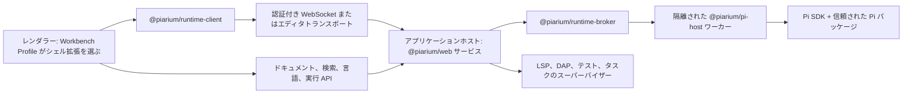

[English](../../README.md) | [简体中文](README.zh-CN.md) | [繁體中文](README.zh-TW.md) | [Français](README.fr.md) | 日本語

# Piarium

<p align="center">
  <picture>
    <source media="(prefers-color-scheme: dark)" srcset="../../packages/web/public/logo-dark-512x512.svg" />
    
  </picture>
</p>

[](https://github.com/Youzini-afk/Piarium/actions/workflows/ci.yml)
[](https://github.com/Youzini-afk/Piarium/actions/workflows/docker.yml)
[](../../LICENSE)

**コーディングエージェントのための Pi ネイティブで再構成可能なワークスペース。ローカル作業を中心に
据えつつ、デスクトップ、Web、エディタ、モバイルのいずれからも使えます。**

Piarium は [Pi コーディングエージェント](https://github.com/earendil-works/pi)を、製品として完成した
ワークスペースに拡張します。Pi の公開 SDK、セッションツリー、パッケージマネージャー、拡張モデルを
そのまま使うため、ターミナル出力のスクレイピングも、恒久的な OpenCode 互換レイヤーもありません。

その UI は固定されたシェルではありません。Piarium には 2 つの公式ワークスタイルが同梱されています。
セッション、タスク、コンテキストを中心に据えた **Agent Workspace** と、エディタ、検索、Git、診断、
デバッグを中心に据え、エージェントをドッキング可能なパネルとして扱う **IDE Workbench** です。どちらも
Workbench Profile によって選択される通常の Piarium 拡張なので、どちらか一方を丸ごと置き換えることも、
その一部だけを置き換えることもできます。

> [!IMPORTANT]
> Piarium は 1.0 前で、活発に開発中です。各プロダクトサーフェスとプライベートなランタイムプロトコルは
> いまのところ同時に進むため、古いビルドが新しいビルドと相互運用できる保証はありません。重要な
> ワークスペースはバックアップし、継続的なデプロイでは検証済みのイメージダイジェストに固定してください。

## Piarium が提供するもの

- **Pi ネイティブな会話：** ストリーミング、分岐、ツリー移動、コンパクション、ステアリングと
  フォローアップのキュー、モデルと思考レベルの選択、セッションの改名、アーカイブ、復元、削除。
- **本物のコーディングワークスペース：** ファイル、差分、Git、worktree、ターミナル、SSH ホスト、
  リモートインスタンス、コメント、エディタコンテキストが、アクティブな Pi セッションとワークスペースを
  共有します。
- **並行するプラグイン機構を作らない：** Pi の `PackageManager` が受け付けるパッケージなら何でも
  インストール、更新、削除、検査できます。専用対応していない拡張も、汎用のコマンド、ツール、エントリ、
  通知、UI の扱いを受けられます。
- **主要プラグインの専用設定画面：** メンテナンス対象のプラグインには目的に沿った GUI がありますが、
  権威はプラグイン自身のネイティブな JSON/JSONC ファイル、コマンド、データベース、マイグレーション
  ロジックのままです。
- **プラグインに委ねた復元：** 会話のロールバックは Pi の追記専用セッションツリーに従います。会話と
  ファイルをまとめた復元、チェックポイント、undo/redo、プロンプト修復は、その履歴を実際に所有している
  プラグインに委譲します。
- **カスタムプロバイダー：** Pi ネイティブなプロバイダー階層、認証、モデル探索、カスタムエンドポイントを
  設定できます。認証情報をレンダラー側のストレージに複製することはありません。
- **再構成可能なワークベンチ：** Agent か IDE のプロファイルを選ぶか、自分で作ります。シェル全体でも、
  ナビゲーション、エディタ、パネル、コンポーザー、タイムライン、ステータスバーだけでも置き換えられ、
  公式とコミュニティの貢献を混ぜられます。切り替えはその場で行われ、ドキュメントの再読み込み、Pi
  ランタイムの再起動、共有ワークスペース状態の喪失は起きません。
- **エディタ級の基盤：** 実際の競合処理を伴うリビジョン管理されたドキュメント権威、CodeMirror 6 上の
  共有エディタグループ、ワークスペース検索、ホストが所有する言語サーバー、標準準拠のデバッグアダプター。
  エージェントの編集は、未保存のバッファを上書きせずに突き合わせます。
- **複数のプロダクトサーフェス：** 共有された React UI が、明示的なランタイム機能を通じて Electron、
  Web、Capacitor モバイルシェルを動かします。VS Code は 2 つ目のワークベンチではなく、エディタの
  コンテキストを Piarium に届けるコンパニオンです。
- **クラウドとリモート運用：** 認証付き WebSocket アクセス、リレー/トンネル対応、マルチアーキテクチャ
  コンテナ、ヘルス検証とロールバックを備えたアトミックな SSH デプロイ。

## メンテナンス対象の拡張統合

Piarium はこれらの拡張を fork せず、そのプライベートな状態も複製しません。公開された Pi のコマンド、
イベント、設定ファイル、ケイパビリティ契約だけを利用するので、パッケージ側は独立して更新を続けられます。

| 拡張 | Piarium の統合内容 |
| --- | --- |
| `pi-subagents` | 拡張の公開 RPC とコマンドを通じた Fleet/タスクの投影と操作 |
| `@cortexkit/pi-magic-context` | ネイティブなユーザー/プロジェクト JSONC 設定、登録済みコマンド、ステータス、公開エントリ |
| `pi-workspace-history` | 会話とワークスペースをまとめた復元、undo、redo、名前付きチェックポイント |
| `pi-wtf` | プロンプト修復アクションと拡張が所有する `wtf.json` 設定 |
| `@piarium/pi-mcp-adapter` | アダプターが所有する実効サーバーカタログ、公開ステータス/アクション、リビジョン付きネイティブソース編集 |
| `pi-web-access` | ネイティブな `web-search.json`、Curator とアカウント操作、保存済み結果の移動 |
| `pi-openai-codex-compat` | ネイティブなグローバル/プロジェクトのリクエスト、推論、リモートコンパクション、Codex ツール設定 |
| `pi-observational-memory` | ネイティブなグローバル/プロジェクトの観測、リフレクション、コンパクション、プール、ワーカー設定 |
| `context-mode` | 推奨のネイティブ Pi パッケージ。単一の正典となる設定ドキュメントがないため汎用のプラグイン設定画面を使用 |
| `pi-lens` | ネイティブなユーザー/最近のプロジェクト設定、診断とフォーマット制御、登録済みコマンドの操作 |
| `@cortexkit/aft-pi` | 編集、検索、意味解析、LSP、バックアップ、サンドボックス設定のためのネイティブなユーザー/プロジェクト JSONC |
| `@gotgenes/pi-permission-system` | ネイティブなグローバル/プロジェクトの権限ポリシー、実行画面の制御、コマンドの利用可否 |
| `pi-hermes-memory` | ネイティブなメモリポリシー、バックグラウンドレビュー、フラッシュ、容量、リコール、モデル上書き設定 |
| `pi-background-tasks` | 公開 EventBus 契約を通じた Fleet 上の可視化、起動、上限付きログ、停止操作 |
| `pi-rtk-optimizer` | ネイティブな厳格 JSON による RTK 書き換え、出力、読み取り、切り詰め設定とコマンドの利用可否 |

各アダプターが読み書きするコマンド、イベント、ネイティブ設定と、どのファイルがプラグイン所有のままかは
[拡張統合の契約](../../docs/extension-compatibility.md)にまとめてあります。Piarium はプラグインのバージョンを
Pi のリリースごとに認証することはしません。

## Piarium 拡張を作る

Piarium のアプリケーション拡張と Pi パッケージは別の製品オブジェクトです。前者は Piarium のワークベンチ、
サーフェス、信頼されたホストを拡張し、後者は Pi エージェントの内部で実行されます。公開 npm ツールチェーンは
Piarium のソースチェックアウトも、製品のプライベート UI からの import も必要としません。

- `@piarium/extension-contract`：マニフェスト、コントリビューション、サービス、ルーティング、探索の契約と JSON Schema;
- `@piarium/extension-sdk`：フレームワーク非依存の Surface、隔離レルム、Host 開発 API;
- `@piarium/extension-react`：任意の React 19 アダプター;
- `@piarium/extension-surface`：高度なテストや別ホスト向けの低レベルなライフサイクルとレジストリ;
- `@piarium/extension-cli`：プロジェクト初期化、検証、ビルド、適合テスト。

拡張プロジェクトを一式作成する:

```sh
npx @piarium/extension-cli init ./my-extension --id dev.example.my-extension --name "My Extension"
cd my-extension
npm install
npx piarium-extension build
npx piarium-extension test
```

マニフェスト、ケイパビリティ、ライフサイクル、ストレージ、公開、テストの完全な契約は
[Piarium 拡張の開発ガイド](../../docs/piarium-extension-authoring.md)を参照してください。

## デスクトップ版のダウンロード

Windows x64/ARM64、Linux x64/ARM64、macOS Intel/Apple Silicon 向けのデスクトップパッケージは
[GitHub Releases](https://github.com/Youzini-afk/Piarium/releases) で配布しています。

## ソースから始める

### 前提条件

- Node.js 22.19 以降。Node.js 24 がソース開発でサポートされる基準
- Bun 1.3.14
- Git
- Windows で Pi のシェルツールを動かす場合は Git for Windows と Git Bash

デスクトップ版は、恒久的に同梱された Pi SDK を使わなくなりました。まずユーザーレベルの Pi インストールを
検出し、その後 Pi Runtime のフローで Pi を選択、インストール、またはダウングレードせずにアップグレード
できます。Piarium は実際の Host ハンドシェイクが成立してから利用可能になり、有効化後に再起動する必要は
ありません。Electron はアプリケーションの実行に必要な Node ランタイムを含みますが、Pi は独立して管理される
ユーザーレベルのツールのままです。Windows、Linux、macOS の x64/ARM64 ネイティブデスクトップパッケージは、
対応するランナー上でアプリケーションの起動、Runtime Manager、ヘルス、ターミナルのライフサイクルを検証して
います。任意のオフラインインストーラーは今後の作業として残っています。コンテナと VS Code 拡張は、無人実行と
エディタホストでの再現性のために、固定された自己完結型の Pi ランタイムを保持します。

### Web 開発サーフェスを起動する

```bash
git clone https://github.com/Youzini-afk/Piarium.git
cd Piarium
bun install --frozen-lockfile
bun run dev
```

ターミナルに表示された Vite の URL を開きます。Piarium は利用可能な開発ポートを選び、UI と一緒に
信頼された API/ランタイムサービスを起動します。

### デスクトップアプリを起動する

```bash
bun run electron:dev
```

パッケージ済みビルドに近い挙動を試すときは、バンドル済みアセットのパスを使います:

```bash
bun run electron:dev:bundled
```

### Windows インストーラーをビルドする

Windows 上で実行してください:

```powershell
bun run electron:build:win
bun run electron:smoke:win
```

NSIS インストーラー、更新メタデータ、blockmap は `packages/electron/dist` に出力されます。コード署名の
資格情報がない場合、インストーラーは意図的に未署名になります。署名とプラットフォームの詳細は
[デスクトップパッケージングガイド](../../packages/electron/README.md#packaging)を参照してください。

## クラウドイメージを動かす

Compose ファイルは既定でスリムイメージ `ghcr.io/youzini-afk/piarium-slim:latest` を使います。Linux の
Docker ホストで:

```bash
mkdir -p data/piarium data/ssh data/cloudflared workspaces
sudo chown -R 1000:1000 data workspaces
umask 077
printf 'PIARIUM_UI_PASSWORD=%s\n' "$(openssl rand -base64 24)" > .env
docker compose up -d
curl --fail http://127.0.0.1:3000/health
```

`http://127.0.0.1:3000` を開き、生成されたパスワードを使います。インターネットに面したデプロイの前には
TLS リバースプロキシか承認済みトンネルを置いてください。必要な転送ルールは
[リバースプロキシの設定](../../docs/REVERSE_PROXY.md)にあります。本番では、可変タグに頼らず `PIARIUM_IMAGE` を
検証済みの不変ダイジェストに設定してください。

エージェントがコンテナ内で Python、Java、Go、Rust をコンパイルする必要がある場合は、toolbelt オーバーレイを
適用します:

```bash
docker compose -f docker-compose.yml -f docker-compose.toolbelt.yml up -d
```

イメージは `linux/amd64` と `linux/arm64` 向けに、provenance と SBOM の attestation 付きで公開されます。
永続パス、環境、コンテナ、SSH ロールバックの完全な契約は[クラウドデプロイ](../../docs/cloud-deployment.md)に
記載しています。

## アーキテクチャ



ブローカーはカタログワーカーとセッションごとのワーカーを所有します。レンダラーの再読み込みで実行中の
タスクは終了せず、Pi ワーカーの障害でレンダラーがクラッシュすることもありません。プロセス境界を越えるのは
プロトコル DTO だけで、SDK のコールバック、認証情報オブジェクト、拡張の実装詳細は越えません。

アプリケーションホストは唯一の信頼されたバックエンドです。リビジョン管理されたドキュメント権威、
ワークスペース検索、言語サーバー、デバッグ/テスト/タスクのプロセスを所有するため、レンダラーは型付きの
リクエストを送るだけで、自分でプロセスを起動しません。Electron は並行するデスクトップバックエンドを
足すのではなく、同じホストをメインプロセスで動かします。Electron の preload 境界を越えるのは、ウィンドウ、
メニュー、ダイアログのようなネイティブ機能だけです。

サードパーティの Pi パッケージは、ユーザーの OS 権限で動く実行可能コードです。Piarium は観測された
ケイパビリティを表示し、プロジェクトローカルな実行可能リソースにゲートを設けますが、信頼された拡張を
完全なサンドボックスに変えるとは主張しません。リモートインスタンスを公開したり、見慣れないコードを
インストールしたりする前に、[セキュリティポリシー](../../.github/SECURITY.md)と
[セキュリティモデル](../../docs/security.md)を読んでください。

## リポジトリ構成

| パス | 責務 |
| --- | --- |
| `packages/ui` | 共有の Pi ネイティブ React UI、ストア、設定、拡張サーフェス |
| `packages/web` | ブラウザ/リモートのフロントエンド、HTTP/WebSocket サービス、クラウド CLI |
| `packages/electron` | ネイティブなデスクトップシェル、特権境界、パッケージング、SSH、更新 |
| `packages/vscode` | VS Code 拡張ホスト、webview、ランタイムブリッジ |
| `packages/mobile` | Piarium サーバーに接続する Capacitor iOS/Android シェル |
| `packages/protocol` | バージョン管理された JSON セーフなワーカー/サーフェスプロトコル |
| `packages/runtime-client` | ブラウザセーフなランタイムのリクエスト/イベントクライアント |
| `packages/runtime-broker` | カタログ/セッションワーカーの所有、ルーティング、シャットダウン |
| `packages/pi-host` | Pi SDK と拡張を埋め込んだ隔離 Node ワーカー |
| `packages/extension-contract` | マニフェスト、コントリビューション、ワークベンチ、サービス、探索の契約 |
| `packages/extension-surface` | フレームワーク非依存の所有スコープとトランザクショナルな Surface レジストリ |
| `packages/extension-sdk`、`-react`、`-cli` | 公開の開発 SDK、React アダプター、作者向けツール |
| `packages/extension-host` | 信頼されたアプリケーションホストのカタログ、成果物、ストレージ、サービス |
| `packages/extension-loader` | 認証付きの managed Surface モジュールローダーと隔離レルム |
| `packages/extension-builtins` | 2 つの公式シェルを含む Piarium 組み込み拡張のマニフェスト |
| `packages/docs` | ユーザー向けドキュメントサイトのソース |
| `docs` | アーキテクチャ、ワークベンチ、移行、復元、プラグイン、クラウド、セキュリティの契約 |
| `scripts` | 開発、リリース、クラウドビルド、デプロイ、検証のツール |

## 開発と検証

コマンドの正典はルートまたは各パッケージの `package.json` スクリプトです。次のローカルな基準セットが
重要な CI ゲートに対応します:

```bash
bun install --frozen-lockfile
bun run type-check
bun run lint
bun run test:pi
bun run test:cloud
bun run build
bun run test:pi:dist
```

CI は責務の異なる 3 つの安定したゲートを持ちます。Ubuntu のソース品質、Windows のランタイム挙動、
Ubuntu の本番ビルドです。型チェック、lint、ワークスペース全体のテストは、それぞれの正典ゲートで一度だけ
実行し、Windows はプラットフォーム依存のカバレッジだけを足します。クラウド/ランタイムの入力が変わると、
Docker ワークフローがコンテナ契約を検証し、対になるスリムと toolbelt のベース/アプリケーションイメージを
ビルドし、不変ダイジェストで両方をスモークし、両候補が通ってからタグを昇格させます。

貢献する前に [CONTRIBUTING.md](../../.github/CONTRIBUTING.md) と、リポジトリ固有のルールである
[AGENTS.md](../../AGENTS.md) を読んでください。

## 設計と運用のドキュメント

- [アーキテクチャ](../../docs/architecture.md)
- [ロードマップ](../../docs/roadmap.md)
- [構成可能なワークベンチと IDE の契約](../../docs/composable-workbench-execution-plan.md)（簡体中国語）
- [Piarium 拡張プラットフォーム](../../docs/piarium-extension-platform.md)
- [VS Code コンパニオンへの移行](../../docs/vscode-companion.md)
- [OpenChamber から Pi への移行契約](../../docs/openchamber-pi-migration.md)
- [プラグイン GUI と所有権の設計](../../docs/plugin-gui-design.md)
- [復元モデル](../../docs/recovery.md)
- [クラウドデプロイ](../../docs/cloud-deployment.md)
- [セキュリティモデル](../../docs/security.md)

## 系譜とライセンス

Piarium はメンテナーの OpenChamber fork を Pi ネイティブにリファクタリングしたものです。

結合著作物としての Piarium は
[GNU Affero General Public License v3.0](../../LICENSE)（`AGPL-3.0-only`）で配布されます。ネットワーク越しに
利用者へ提供される改変版は、ライセンスの要求どおり、対応するソースを利用者が入手できるようにしなければ
なりません。
