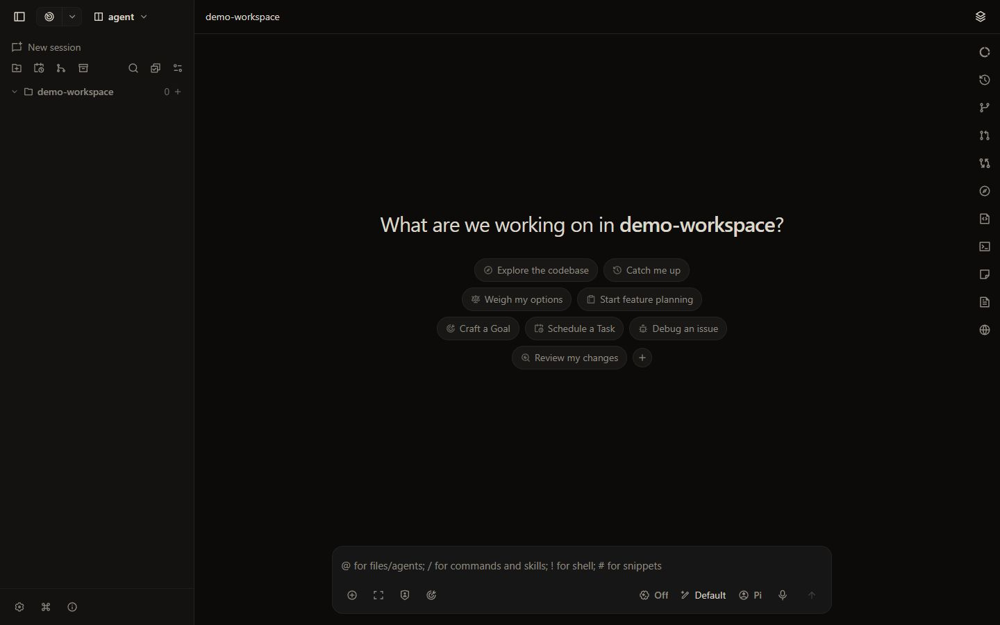
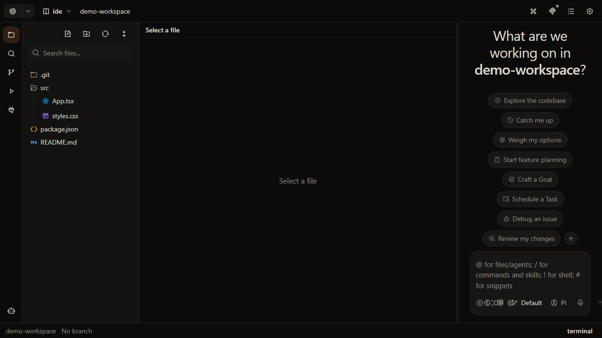
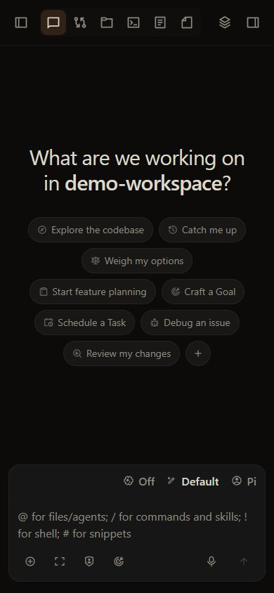
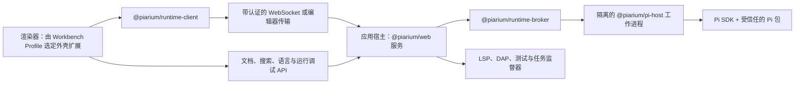

[English](../../README.md) | 简体中文 | [繁體中文](README.zh-TW.md) | [Français](README.fr.md) | [日本語](README.ja.md)

# Piarium

<p align="center">
  <picture>
    <source media="(prefers-color-scheme: dark)" srcset="../../packages/web/public/logo-dark-512x512.svg" />
    
  </picture>
</p>

[](https://github.com/Youzini-afk/Piarium/actions/workflows/ci.yml)
[](https://github.com/Youzini-afk/Piarium/actions/workflows/docker.yml)
[](../../LICENSE)

**一个 Pi 原生、可重组的编程智能体工作空间：以本地和桌面体验为中心，同时覆盖 Web、编辑器与移动端。**

Piarium 将 [Pi 编程智能体](https://github.com/earendil-works/pi)扩展为一套完整的产品工作空间。
它直接使用 Pi 的公开 SDK、会话树、包管理器和扩展模型，不抓取终端输出，也不保留永久的
OpenCode 兼容层。

它的界面不是固定外壳。Piarium 自带两套官方工作形态：**Agent Workspace** 以会话、任务和上下文
为中心，**IDE Workbench** 以编辑器、搜索、Git、诊断和调试为中心并把智能体作为可停靠面板。两者
都是普通的 Piarium 扩展，由 Workbench Profile 选择，因此你可以整体替换其中任意一套，也可以只
替换其中某一个部分。

> [!IMPORTANT]
> Piarium 目前仍处于 1.0 之前的活跃开发阶段。各产品端和私有运行时协议会同步演进，较旧构建
> 不保证与较新构建互通。请备份重要工作区；长期部署时，请固定到已经验证的镜像摘要。

## 产品界面

以下截图使用隔离的 `demo-workspace` 和匿名示例文件生成，不包含个人账号、真实项目、会话或凭据。

### Agent Workspace

项目和会话始终可见，主区域将当前智能体、上下文工具与输入框集中在同一个工作空间中。



### IDE Workbench

IDE Profile 将工作区导航和编辑器基础设施与完整的 Pi 智能体并排组合，而不是把聊天拆成另一个应用。



### 移动端工作空间

响应式界面在手机屏幕上保留同一套项目、智能体控制、上下文界面和输入框。

<p align="center">
  
</p>

## Piarium 提供什么

- **Pi 原生会话：** 支持流式响应、分支、会话树导航、压缩、引导和后续消息队列、模型与思考
  级别选择，以及会话重命名、归档、恢复和删除。
- **真正的编程工作空间：** 文件、Diff、Git、工作树、终端、SSH 主机、远程实例、代码评论和
  编辑器上下文，共享当前 Pi 会话及其工作目录。
- **不另造一套插件系统：** 可以安装、更新、移除和检查 Pi `PackageManager` 接受的任意包。
  尚未专门适配的扩展仍可使用通用的命令、工具、条目、通知和 UI 桥接。
- **常用插件的专用配置界面：** 已维护的插件拥有针对性的 GUI，同时继续以插件自己的原生
  JSON/JSONC 文件、命令、数据库和迁移逻辑为权威。
- **由插件提供的恢复能力：** 对话回退沿用 Pi 的追加式会话树；对话与文件联合恢复、检查点、
  撤销/重做和提示词修复，则委托给真正拥有相应历史的插件。
- **自定义提供商：** 配置 Pi 原生的提供商分层、认证、模型发现和自定义端点，不把凭据复制到
  渲染进程存储中。
- **可重组的工作台：** 选择 Agent 或 IDE Profile，也可以自建。既能替换整个外壳，也能只替换导航、
  编辑器、面板、Composer、Timeline 或状态栏，并混用官方与社区贡献。切换是实时的，不刷新文档、
  不重启 Pi 运行时、不丢失共享的工作区状态。
- **编辑器级基础设施：** 一套带版本的文档权威和真实的冲突处理；桌面/Web 的 Agent 与 IDE 共用
  Monaco model、编辑器组、工作区搜索、宿主侧语言服务器和标准调试适配器，移动/嵌入式编辑器通过
  轻量 CodeMirror adapter 接入同一文档权威。智能体的修改会与你未保存的缓冲区协调，而不是直接覆盖。
- **多个产品端：** Electron、Web 和 Capacitor 移动端外壳共享一套 React UI，并通过明确的运行时
  能力与宿主通信；VS Code 是把编辑器上下文送进 Piarium 的伴侧扩展，而不是第二套工作台。
- **云端与远程运行：** 支持带认证的 WebSocket、Relay/隧道、多架构容器，以及经过健康检查和
  可回滚的原子 SSH 部署。

## 已维护的扩展集成

Piarium 不会 fork 这些扩展，也不会复制它们的私有状态。集成只依赖插件公开的 Pi 命令、事件、
设置文件和能力协议，因此插件可以继续独立更新。

| 扩展 | Piarium 集成 |
| --- | --- |
| `pi-subagents` | 通过插件公开的 RPC 和命令展示并控制 Fleet/任务树 |
| `@cortexkit/pi-magic-context` | 原生用户/项目 JSONC 配置、已注册命令、状态和公开条目 |
| `pi-workspace-history` | 对话与工作区联合恢复、撤销、重做和命名检查点 |
| `pi-wtf` | 提示词修复操作和插件自有的 `wtf.json` 配置 |
| `@piarium/pi-mcp-adapter` | 插件计算的有效服务目录、公开状态与操作，以及带版本校验的原生配置来源编辑 |
| `pi-web-access` | 原生 `web-search.json`、Curator 与账号操作、已保存结果导航 |
| `pi-openai-codex-compat` | 原生的全局/项目请求、推理、远程压缩和 Codex 工具配置 |
| `pi-observational-memory` | 原生的全局/项目观察、反思、压缩、池和工作进程配置 |
| `context-mode` | 推荐的原生 Pi 包；因没有单一权威设置文件，使用通用插件配置界面 |
| `pi-lens` | 原生用户/最近项目配置、诊断与格式化控制，以及已注册命令操作 |
| `@cortexkit/aft-pi` | 原生用户/项目 JSONC 中的编辑、搜索、语义分析、LSP、备份和沙箱配置 |
| `@gotgenes/pi-permission-system` | 原生全局/项目权限策略、运行界面控制和命令可用状态 |
| `pi-hermes-memory` | 原生记忆策略、后台审查、刷新、容量、召回和模型覆盖配置 |
| `pi-background-tasks` | 通过公开 EventBus 在 Fleet 中查看、启动、读取日志和停止后台任务 |
| `pi-rtk-optimizer` | 原生严格 JSON 中的 RTK 改写、输出、读取和截断配置，以及命令可用状态 |

每个扩展的集成面——Piarium 读取或调用哪些命令、事件和原生配置，以及哪些文件仍归插件所有——记录在
[扩展集成契约](../../docs/extension-compatibility.md)。Piarium 不逐版本认证插件与 Pi 的搭配。

## 开发 Piarium 扩展

Piarium 应用扩展与 Pi 插件是两个独立的产品对象：前者扩展 Piarium 的工作台、页面和可信宿主，
后者运行在 Pi 智能体中。公开的 npm 工具链不要求检出 Piarium 源码，也不要求扩展导入产品私有 UI：

- `@piarium/extension-contract`：清单、贡献、服务、路由和发现协议及 JSON Schema；
- `@piarium/extension-sdk`：与 UI 框架无关的 Surface、隔离运行域和 Host 开发 API；
- `@piarium/extension-react`：可选的 React 19 适配器；
- `@piarium/extension-surface`：供高级测试和替代宿主使用的底层生命周期与注册表；
- `@piarium/extension-cli`：项目初始化、检查、构建和一致性测试。

创建一个完整的扩展项目：

```sh
npx @piarium/extension-cli init ./my-extension --id dev.example.my-extension --name "My Extension"
cd my-extension
npm install
npx piarium-extension build
npx piarium-extension test
```

完整的清单格式、能力、生命周期、存储、发布和测试说明见
[Piarium 扩展开发指南](../../docs/piarium-extension-authoring.md)。

## 下载桌面版

Windows x64/ARM64、Linux x64/ARM64，以及 macOS Intel/Apple Silicon 桌面包发布在
[GitHub Releases](https://github.com/Youzini-afk/Piarium/releases)。

## 从源码开始

### 环境要求

- Node.js 22.19 或更高版本；Node.js 24 是当前支持的源码开发基线
- Bun 1.3.14
- Git
- 在 Windows 上运行 Pi shell 工具时，需要 Git for Windows 和 Git Bash

桌面端不再使用永久捆绑的 Pi SDK。它会先发现用户级 Pi 安装，再由“Pi 运行时”引导用户选择、安装
或仅向上升级 Pi；完成真实 Host 握手后即可使用，无需重启 Piarium。Electron 自带运行应用所需的
Node 环境，但 Pi 本身仍作为独立的用户级工具存在。Windows、Linux 和 macOS 的 x64/ARM64 原生桌面包
均在对应架构的 runner 上验证应用启动、运行时设置、健康检查和终端生命周期；可选离线包仍待后续提供。
容器和 VS Code 扩展则固定自带经过验证的 Pi 运行时，以保证无人值守部署和编辑器宿主可复现。

### 运行 Web 开发环境

```bash
git clone https://github.com/Youzini-afk/Piarium.git
cd Piarium
bun install --frozen-lockfile
bun run dev
```

打开终端输出的 Vite 地址。Piarium 会选择可用的开发端口，并同时启动 UI 与可信 API/运行时服务。

### 运行桌面应用

```bash
bun run electron:dev
```

需要测试更接近安装包的内置资源模式时，运行：

```bash
bun run electron:dev:bundled
```

### 构建 Windows 安装包

请在 Windows 上运行：

```powershell
bun run electron:build:win
bun run electron:smoke:win
```

NSIS 安装包、更新元数据和 blockmap 会输出到 `packages/electron/dist`。没有配置代码签名凭据时，
构建会有意生成未签名安装包。签名方式和其他平台说明见
[桌面打包指南](../../packages/electron/README.md#packaging)。

## 运行云端镜像

Compose 默认使用精简镜像 `ghcr.io/youzini-afk/piarium-slim:latest`。在 Linux Docker 主机上运行：

```bash
mkdir -p data/piarium data/ssh data/cloudflared workspaces
sudo chown -R 1000:1000 data workspaces
umask 077
printf 'PIARIUM_UI_PASSWORD=%s\n' "$(openssl rand -base64 24)" > .env
docker compose up -d
curl --fail http://127.0.0.1:3000/health
```

打开 `http://127.0.0.1:3000`，使用刚生成的密码登录。任何面向公网的部署都应置于 TLS 反向代理
或经过审核的隧道之后，具体转发要求见[反向代理配置](../../docs/REVERSE_PROXY.md)。生产环境请将
`PIARIUM_IMAGE` 固定为已验证的不可变摘要，不要依赖浮动标签。

若智能体要在容器里编译 Python、Java、Go 或 Rust，叠加工具链覆盖层：

```bash
docker compose -f docker-compose.yml -f docker-compose.toolbelt.yml up -d
```

镜像同时发布 `linux/amd64` 和 `linux/arm64` 版本，并带有 provenance 与 SBOM 证明。持久化路径、
环境变量、容器及 SSH 回滚的完整约定见[云端部署](../../docs/cloud-deployment.md)。

## 架构



Broker 管理一个目录工作进程和每个会话各自的工作进程。渲染器重新加载不会终止正在执行的任务，
Pi 工作进程异常也不会让渲染器一同崩溃。跨进程传输的是 Piarium 协议 DTO；SDK 回调、凭据对象和
扩展实现细节不会越过这条边界。

应用宿主是唯一的可信后端。它拥有带版本的文档权威、工作区搜索、语言服务器以及调试/测试/任务进程，
所以渲染器只发送带类型的请求，从不自己启动进程。Electron 在主进程里运行同一个宿主，而不是再造一套
桌面后端；只有窗口、菜单、对话框这类真正的原生能力才跨过 Electron preload 边界。

第三方 Pi 包是拥有当前用户操作系统权限的可执行代码。Piarium 会展示观察到的能力，并对项目内
可执行资源设置授权门槛，但不会把受信任扩展宣传成完整的沙箱。在公开远程实例或安装陌生代码之前，
请阅读[安全策略](../translations/SECURITY.zh-CN.md)和[安全模型](../../docs/security.md)。

## 仓库结构

| 路径 | 职责 |
| --- | --- |
| `packages/ui` | 共享的 Pi 原生 React UI、状态、设置和扩展界面 |
| `packages/web` | 浏览器/远程前端、HTTP/WebSocket 服务和云端 CLI |
| `packages/electron` | 原生桌面外壳、特权边界、打包、SSH 和更新 |
| `packages/vscode` | VS Code 扩展宿主、Webview 和运行时桥接 |
| `packages/mobile` | 连接 Piarium 服务端的 Capacitor iOS/Android 外壳 |
| `packages/protocol` | 带版本且可安全 JSON 序列化的工作进程/产品端协议 |
| `packages/runtime-client` | 可在浏览器中使用的运行时请求/事件客户端 |
| `packages/runtime-broker` | 目录/会话工作进程的管理、路由和关闭 |
| `packages/pi-host` | 嵌入 Pi SDK 和扩展的隔离 Node 工作进程 |
| `packages/extension-contract` | 清单、贡献、工作台、服务和发现协议 |
| `packages/extension-surface` | 与框架无关的归属域和事务式 Surface 注册表 |
| `packages/extension-sdk`、`-react`、`-cli` | 公开的作者 SDK、React 适配器和作者工具链 |
| `packages/extension-host` | 可信应用宿主的目录、构件、存储与服务 |
| `packages/extension-loader` | 带认证的 managed Surface 模块加载器与隔离运行域 |
| `packages/extension-builtins` | Piarium 内置扩展的清单，含两套官方外壳 |
| `packages/docs` | 面向用户的文档站源码 |
| `docs` | 架构、工作台、迁移、恢复、插件、云端和安全约定 |
| `scripts` | 开发、发布、云端构建、部署和校验工具 |

## 开发与校验

以根目录或各包的 `package.json` 脚本为准。下面这组本地基线覆盖 CI 的主要质量门槛：

```bash
bun install --frozen-lockfile
bun run type-check
bun run lint
bun run test:pi
bun run test:cloud
bun run build
bun run test:pi:dist
```

CI 固定为三条职责不同的门禁：Ubuntu 源码质量、Windows 运行时行为和 Ubuntu 生产构建。
类型检查、lint 和全仓测试只在权威门禁中执行一次；Windows 只补充平台相关测试。云端/运行时输入
发生变化时，Docker 工作流只验证容器契约，并构建配套的精简与工具链基础镜像及应用镜像；两个
候选应用都通过不可变摘要烟测后，才会提升可安装标签。

参与贡献前，请阅读[工程开发指南](../../docs/development.md)、[贡献指南](../translations/CONTRIBUTING.zh-CN.md)和精简的
仓库边界说明 [AGENTS.md](../../AGENTS.md)。

## 设计与运维文档

- [工程开发与知识导航](../../docs/development.md)
- [架构](../../docs/architecture.md)
- [路线图](../../docs/roadmap.md)
- [可组合工作台与 IDE 约定](../../docs/composable-workbench-execution-plan.md)
- [统一文件编辑器平台](../../docs/unified-file-editor-platform.md)
- [Piarium 扩展平台](../../docs/piarium-extension-platform.md)
- [VS Code 伴侧迁移](../../docs/vscode-companion.md)
- [从 OpenChamber 迁移到 Pi 的约定](../../docs/openchamber-pi-migration.md)
- [插件 GUI 与状态归属设计](../../docs/plugin-gui-design.md)
- [恢复模型](../../docs/recovery.md)
- [云端部署](../../docs/cloud-deployment.md)
- [安全模型](../../docs/security.md)

## 项目沿革与许可证

Piarium 是维护者 OpenChamber fork 的 Pi 原生重构。

Piarium 作为组合后的完整作品，按照
[GNU Affero General Public License v3.0](../../LICENSE)（`AGPL-3.0-only`）发布。通过网络向用户提供
修改版时，必须按照许可证要求向这些用户提供对应源码。
