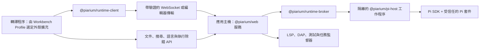

[English](../../README.md) | [简体中文](README.zh-CN.md) | 繁體中文 | [Français](README.fr.md) | [日本語](README.ja.md)

# Piarium

<p align="center">
  <picture>
    <source media="(prefers-color-scheme: dark)" srcset="../../packages/web/public/logo-dark-512x512.svg" />
    
  </picture>
</p>

[](https://github.com/Youzini-afk/Piarium/actions/workflows/ci.yml)
[](https://github.com/Youzini-afk/Piarium/actions/workflows/docker.yml)
[](../../LICENSE)

**一套 Pi 原生、可重組的程式設計代理工作空間：以本機與桌面體驗為中心，同時涵蓋 Web、編輯器與行動端。**

Piarium 把 [Pi 程式設計代理](https://github.com/earendil-works/pi)擴展成一套完整的產品工作空間。
它直接使用 Pi 的公開 SDK、會話樹、套件管理器和擴充模型，不擷取終端機輸出，也不保留永久的
OpenCode 相容層。

它的介面不是固定外殼。Piarium 內建兩套官方工作形態：**Agent Workspace** 以會話、任務和上下文
為中心，**IDE Workbench** 以編輯器、搜尋、Git、診斷和除錯為中心，並把代理程式當成可停駐的面板。
兩者都是普通的 Piarium 擴充，由 Workbench Profile 選擇，因此你可以整體替換其中任一套，也可以只
替換其中某一個部分。

> [!IMPORTANT]
> Piarium 目前仍處於 1.0 之前的活躍開發階段。各產品端和私有執行期協定會同步演進，較舊的組建
> 不保證能與較新的組建互通。請備份重要的工作區；長期部署時，請固定到已經驗證過的映像摘要。

## Piarium 提供什麼

- **Pi 原生會話：** 支援串流回應、分支、會話樹導覽、壓縮、引導和後續訊息佇列、模型與思考
  等級選擇，以及會話重新命名、封存、還原和刪除。
- **真正的程式設計工作空間：** 檔案、Diff、Git、工作樹、終端機、SSH 主機、遠端實例、程式碼評論和
  編輯器上下文，共用當前的 Pi 會話及其工作目錄。
- **不另造一套外掛系統：** 可以安裝、更新、移除和檢查 Pi `PackageManager` 接受的任意套件。
  尚未專門適配的擴充仍可使用通用的命令、工具、項目、通知和 UI 橋接。
- **常用外掛的專用設定介面：** 已維護的外掛擁有針對性的 GUI，同時繼續以外掛自己的原生
  JSON/JSONC 檔案、命令、資料庫和遷移邏輯為權威。
- **由外掛提供的還原能力：** 對話回退沿用 Pi 的附加式會話樹；對話與檔案聯合還原、檢查點、
  復原/重做和提示詞修復，則委派給真正擁有相應歷史的外掛。
- **自訂供應商：** 設定 Pi 原生的供應商分層、驗證、模型發現和自訂端點，不把憑證複製到
  轉譯程序的儲存空間中。
- **可重組的工作台：** 選擇 Agent 或 IDE Profile，也可以自建。既能替換整個外殼，也能只替換導覽、
  編輯器、面板、Composer、Timeline 或狀態列，並混用官方與社群貢獻。切換是即時的，不重新載入文件、
  不重啟 Pi 執行期、不遺失共用的工作區狀態。
- **編輯器級基礎設施：** 一套帶版本的文件權威和真實的衝突處理、基於 CodeMirror 6 的共用編輯器群組、
  工作區搜尋、主機端語言伺服器，以及符合標準的除錯轉接器。代理程式的修改會與你尚未儲存的緩衝區
  協調，而不是直接覆寫。
- **多個產品端：** Electron、Web 和 Capacitor 行動端外殼共用一套 React UI，並透過明確的執行期
  能力與主機通訊；VS Code 是把編輯器上下文送進 Piarium 的伴隨擴充，而不是第二套工作台。
- **雲端與遠端執行：** 支援帶驗證的 WebSocket、Relay/通道、多架構容器，以及經過健康檢查且
  可回滾的原子 SSH 部署。

## 已維護的擴充整合

Piarium 不會 fork 這些擴充，也不會複製它們的私有狀態。整合只依賴外掛公開的 Pi 命令、事件、
設定檔和能力協定，因此外掛可以繼續獨立更新。

| 擴充 | Piarium 整合 |
| --- | --- |
| `pi-subagents` | 透過外掛公開的 RPC 和命令呈現並控制 Fleet/任務樹 |
| `@cortexkit/pi-magic-context` | 原生使用者/專案 JSONC 設定、已註冊命令、狀態和公開項目 |
| `pi-workspace-history` | 對話與工作區聯合還原、復原、重做和具名檢查點 |
| `pi-wtf` | 提示詞修復操作和外掛自有的 `wtf.json` 設定 |
| `@piarium/pi-mcp-adapter` | 外掛計算的有效服務目錄、公開狀態與操作，以及帶版本校驗的原生設定來源編輯 |
| `pi-web-access` | 原生 `web-search.json`、Curator 與帳號操作、已儲存結果導覽 |
| `pi-openai-codex-compat` | 原生的全域/專案請求、推理、遠端壓縮和 Codex 工具設定 |
| `pi-observational-memory` | 原生的全域/專案觀察、反思、壓縮、集區和工作程序設定 |
| `context-mode` | 推薦的原生 Pi 套件；因沒有單一權威設定檔，使用通用外掛設定介面 |
| `pi-lens` | 原生使用者/最近專案設定、診斷與格式化控制，以及已註冊命令操作 |
| `@cortexkit/aft-pi` | 原生使用者/專案 JSONC 中的編輯、搜尋、語意分析、LSP、備份和沙箱設定 |
| `@gotgenes/pi-permission-system` | 原生全域/專案權限策略、執行介面控制和命令可用狀態 |
| `pi-hermes-memory` | 原生記憶策略、背景審查、清出、容量、召回和模型覆寫設定 |
| `pi-background-tasks` | 透過公開 EventBus 在 Fleet 中檢視、啟動、讀取記錄和停止背景任務 |
| `pi-rtk-optimizer` | 原生嚴格 JSON 中的 RTK 改寫、輸出、讀取和截斷設定，以及命令可用狀態 |

每個擴充的整合面——Piarium 讀取或呼叫哪些命令、事件和原生設定，以及哪些檔案仍歸外掛所有——記錄在
[擴充整合約定](../../docs/extension-compatibility.md)。Piarium 不逐版本認證外掛與 Pi 的搭配。

## 開發 Piarium 擴充

Piarium 應用擴充與 Pi 外掛是兩個獨立的產品對象：前者擴展 Piarium 的工作台、頁面和受信任主機，
後者執行在 Pi 代理程式中。公開的 npm 工具鏈不要求取出 Piarium 原始碼，也不要求擴充匯入產品私有的 UI：

- `@piarium/extension-contract`：清單、貢獻、服務、路由和發現協定及 JSON Schema；
- `@piarium/extension-sdk`：與 UI 框架無關的 Surface、隔離執行域和 Host 開發 API；
- `@piarium/extension-react`：選用的 React 19 轉接器；
- `@piarium/extension-surface`：供進階測試和替代主機使用的底層生命週期與註冊表；
- `@piarium/extension-cli`：專案初始化、檢查、組建和一致性測試。

建立一個完整的擴充專案：

```sh
npx @piarium/extension-cli init ./my-extension --id dev.example.my-extension --name "My Extension"
cd my-extension
npm install
npx piarium-extension build
npx piarium-extension test
```

完整的清單格式、能力、生命週期、儲存、發布和測試說明見
[Piarium 擴充開發指南](../../docs/piarium-extension-authoring.md)。

## 下載桌面版

Windows x64/ARM64、Linux x64/ARM64，以及 macOS Intel/Apple Silicon 桌面套件發布在
[GitHub Releases](https://github.com/Youzini-afk/Piarium/releases)。

## 從原始碼開始

### 環境需求

- Node.js 22.19 或更新版本；Node.js 24 是目前支援的原始碼開發基準
- Bun 1.3.14
- Git
- 在 Windows 上執行 Pi shell 工具時，需要 Git for Windows 和 Git Bash

桌面端不再使用永久隨附的 Pi SDK。它會先發現使用者層級的 Pi 安裝，再由「Pi 執行期」引導使用者選擇、
安裝或僅向上升級 Pi；完成真實的 Host 交握後即可使用，無需重啟 Piarium。Electron 自帶執行應用程式
所需的 Node 環境，但 Pi 本身仍是獨立的使用者層級工具。Windows、Linux 和 macOS 的 x64/ARM64 原生桌面
套件都在對應架構的 runner 上驗證應用程式啟動、執行期設定、健康檢查和終端機生命週期；選用的離線
安裝套件仍待後續提供。容器和 VS Code 擴充則固定自帶經過驗證的 Pi 執行期，以確保無人值守部署和
編輯器主機可重現。

### 執行 Web 開發環境

```bash
git clone https://github.com/Youzini-afk/Piarium.git
cd Piarium
bun install --frozen-lockfile
bun run dev
```

開啟終端機輸出的 Vite 位址。Piarium 會選擇可用的開發連接埠，並同時啟動 UI 與受信任的 API/執行期服務。

### 執行桌面應用程式

```bash
bun run electron:dev
```

需要測試更接近安裝套件的內建資源模式時，執行：

```bash
bun run electron:dev:bundled
```

### 組建 Windows 安裝套件

請在 Windows 上執行：

```powershell
bun run electron:build:win
bun run electron:smoke:win
```

NSIS 安裝套件、更新中介資料和 blockmap 會輸出到 `packages/electron/dist`。沒有設定程式碼簽署憑證時，
組建會刻意產生未簽署的安裝套件。簽署方式和其他平台說明見
[桌面封裝指南](../../packages/electron/README.md#packaging)。

## 執行雲端映像

Compose 預設使用精簡映像 `ghcr.io/youzini-afk/piarium-slim:latest`。在 Linux Docker 主機上執行：

```bash
mkdir -p data/piarium data/ssh data/cloudflared workspaces
sudo chown -R 1000:1000 data workspaces
umask 077
printf 'PIARIUM_UI_PASSWORD=%s\n' "$(openssl rand -base64 24)" > .env
docker compose up -d
curl --fail http://127.0.0.1:3000/health
```

開啟 `http://127.0.0.1:3000`，使用剛產生的密碼登入。任何面向公開網路的部署都應置於 TLS 反向代理
或經過審核的通道之後，具體轉送要求見[反向代理設定](../../docs/REVERSE_PROXY.md)。生產環境請將
`PIARIUM_IMAGE` 固定為已驗證的不可變摘要，不要依賴浮動標籤。

若代理程式要在容器裡編譯 Python、Java、Go 或 Rust，疊加工具鏈覆疊層：

```bash
docker compose -f docker-compose.yml -f docker-compose.toolbelt.yml up -d
```

映像同時發布 `linux/amd64` 和 `linux/arm64` 版本，並帶有 provenance 與 SBOM 證明。持續保存路徑、
環境變數、容器及 SSH 回滾的完整約定見[雲端部署](../../docs/cloud-deployment.md)。

## 架構



Broker 管理一個目錄工作程序，以及每個會話各自的工作程序。轉譯程序重新載入不會終止正在執行的任務，
Pi 工作程序異常也不會讓轉譯程序一同崩潰。跨程序傳輸的是 Piarium 協定 DTO；SDK 回呼、憑證物件和
擴充實作細節不會越過這條邊界。

應用主機是唯一受信任的後端。它擁有帶版本的文件權威、工作區搜尋、語言伺服器以及除錯/測試/任務程序，
所以轉譯程序只送出帶型別的請求，從不自己啟動程序。Electron 在主程序裡執行同一個主機，而不是再造
一套桌面後端；只有視窗、選單、對話框這類真正的原生能力才跨過 Electron preload 邊界。

第三方 Pi 套件是擁有當前使用者作業系統權限的可執行程式碼。Piarium 會呈現觀察到的能力，並對專案內
可執行資源設置授權門檻，但不會把受信任的擴充宣傳成完整的沙箱。在公開遠端實例或安裝陌生程式碼之前，
請閱讀[安全政策](../../.github/SECURITY.md)和[安全模型](../../docs/security.md)。

## 儲存庫結構

| 路徑 | 職責 |
| --- | --- |
| `packages/ui` | 共用的 Pi 原生 React UI、狀態、設定和擴充介面 |
| `packages/web` | 瀏覽器/遠端前端、HTTP/WebSocket 服務和雲端 CLI |
| `packages/electron` | 原生桌面外殼、特權邊界、封裝、SSH 和更新 |
| `packages/vscode` | VS Code 擴充主機、Webview 和執行期橋接 |
| `packages/mobile` | 連接 Piarium 伺服器的 Capacitor iOS/Android 外殼 |
| `packages/protocol` | 帶版本且可安全 JSON 序列化的工作程序/產品端協定 |
| `packages/runtime-client` | 可在瀏覽器中使用的執行期請求/事件用戶端 |
| `packages/runtime-broker` | 目錄/會話工作程序的管理、路由和關閉 |
| `packages/pi-host` | 嵌入 Pi SDK 和擴充的隔離 Node 工作程序 |
| `packages/extension-contract` | 清單、貢獻、工作台、服務和發現協定 |
| `packages/extension-surface` | 與框架無關的歸屬域和交易式 Surface 註冊表 |
| `packages/extension-sdk`、`-react`、`-cli` | 公開的作者 SDK、React 轉接器和作者工具鏈 |
| `packages/extension-host` | 受信任應用主機的目錄、構件、儲存與服務 |
| `packages/extension-loader` | 帶驗證的 managed Surface 模組載入器與隔離執行域 |
| `packages/extension-builtins` | Piarium 內建擴充的清單，含兩套官方外殼 |
| `packages/docs` | 面向使用者的文件站原始碼 |
| `docs` | 架構、工作台、遷移、還原、外掛、雲端和安全約定 |
| `scripts` | 開發、發布、雲端組建、部署和驗證工具 |

## 開發與驗證

以根目錄或各套件的 `package.json` 指令為準。下面這組本機基準涵蓋 CI 的主要品質門檻：

```bash
bun install --frozen-lockfile
bun run type-check
bun run lint
bun run test:pi
bun run test:cloud
bun run build
bun run test:pi:dist
```

CI 固定為三條職責不同的門檻：Ubuntu 原始碼品質、Windows 執行期行為和 Ubuntu 生產組建。
型別檢查、lint 和全儲存庫測試只在權威門檻中執行一次；Windows 只補充平台相關測試。雲端/執行期輸入
發生變化時，Docker 工作流程只驗證容器約定，並組建配套的精簡與工具鏈基礎映像及應用映像；兩個
候選應用都通過不可變摘要煙霧測試後，才會提升可安裝的標籤。

參與貢獻前，請閱讀[貢獻指南](../../.github/CONTRIBUTING.md)和儲存庫專用規則 [AGENTS.md](../../AGENTS.md)。

## 設計與維運文件

- [架構](../../docs/architecture.md)
- [藍圖](../../docs/roadmap.md)
- [可組合工作台與 IDE 約定](../../docs/composable-workbench-execution-plan.md)（簡體中文）
- [Piarium 擴充平台](../../docs/piarium-extension-platform.md)
- [VS Code 伴隨遷移](../../docs/vscode-companion.md)
- [從 OpenChamber 遷移到 Pi 的約定](../../docs/openchamber-pi-migration.md)
- [外掛 GUI 與狀態歸屬設計](../../docs/plugin-gui-design.md)
- [還原模型](../../docs/recovery.md)
- [雲端部署](../../docs/cloud-deployment.md)
- [安全模型](../../docs/security.md)

## 專案沿革與授權

Piarium 是維護者 OpenChamber fork 的直接 Pi 原生重構。該 fork 是產品和 UI 的來源，不是執行期
依賴：隨著 Pi 原生實作成為權威，過時的 OpenCode 程序、用戶端、Schema 和相容路徑會被移除。

Piarium 作為組合後的完整作品，依照
[GNU Affero General Public License v3.0](../../LICENSE)（`AGPL-3.0-only`）發布。透過網路向使用者提供
修改版時，必須按照授權條款要求向這些使用者提供對應的原始碼。

匯入的寬鬆授權程式碼仍保留其原始聲明；保留這些聲明不代表 Piarium 整體仍可依 MIT License 使用。
詳情見[第三方聲明](../../THIRD_PARTY_NOTICES.md)。Pi 和第三方 Pi 套件是獨立專案，並分別遵循它們自己的
授權條款。
