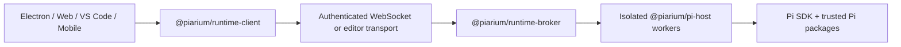

English | [简体中文](README.md)

# Piarium

<p align="center">
  <picture>
    <source media="(prefers-color-scheme: dark)" srcset="packages/web/public/logo-dark-512x512.svg" />
    
  </picture>
</p>

[](https://github.com/Youzini-afk/Piarium/actions/workflows/ci.yml)
[](https://github.com/Youzini-afk/Piarium/actions/workflows/docker.yml)
[](LICENSE)

**A Pi-native workspace for coding agents, built for local work and usable across desktop, web,
editors, and mobile clients.**

Piarium turns the [Pi coding agent](https://github.com/earendil-works/pi) into a complete product
workspace. It uses Pi's public SDK, session tree, package manager, and extension model directly—no
terminal scraping and no permanent OpenCode compatibility layer.

> [!IMPORTANT]
> Piarium is pre-1.0 and under active development. Product surfaces and the private runtime protocol
> currently advance together, so older builds are not guaranteed to interoperate with newer ones.
> Back up important workspaces and pin a tested image digest for persistent deployments.

## What Piarium provides

- **Pi-native conversations:** streaming, branching, tree navigation, compaction, steering and
  follow-up queues, model and thinking selection, session rename, archive, restore, and deletion.
- **A real coding workspace:** files, diffs, Git, worktrees, terminals, SSH hosts, remote instances,
  comments, and editor context share the active Pi session and workspace.
- **Packages without a parallel plugin system:** install, update, remove, and inspect any package
  accepted by Pi's `PackageManager`. Unknown extensions still receive generic command, tool, entry,
  notification, and UI handling.
- **First-class plugin configuration:** maintained plugins get focused GUI surfaces while their own
  native JSON/JSONC files, commands, databases, and migration logic remain authoritative.
- **Plugin-backed recovery:** conversation rollback follows Pi's append-only session tree;
  conversation-plus-files recovery, checkpoints, undo/redo, and prompt repair delegate to the
  plugins that own that history.
- **Custom providers:** configure Pi-native provider layers, authentication, model discovery, and
  custom endpoints without mirroring credentials into renderer storage.
- **Multiple product surfaces:** a shared React UI powers Electron, Web, VS Code, and the Capacitor
  mobile shell through explicit runtime capabilities.
- **Cloud and remote operation:** authenticated WebSocket access, relay/tunnel support,
  multi-architecture containers, and atomic SSH deployment with health validation and rollback.

## Maintained extension integrations

Piarium does not fork these extensions or copy their private state. It consumes their public Pi
commands, events, settings files, and capability contracts, so package updates can continue to
advance independently.

| Extension | Piarium integration |
| --- | --- |
| `pi-subagents` | Fleet/task projections and controls through the extension's public RPC and commands |
| `@cortexkit/pi-magic-context` | Native user/project JSONC configuration, registered commands, status, and public entries |
| `pi-workspace-history` | Combined conversation/workspace restore, undo, redo, and named checkpoints |
| `pi-wtf` | Prompt repair actions and extension-owned `wtf.json` configuration |
| `pi-mcp-adapter` | Adapter-owned effective server catalog, public status/actions, and revisioned native-source editing |
| `pi-web-access` | Native `web-search.json`, Curator and account actions, and stored-result navigation |
| `pi-openai-codex-compat` | Native global/project request, reasoning, remote-compaction, and Codex-tool configuration |
| `pi-observational-memory` | Native global/project observation, reflection, compaction, pool, and worker configuration |
| `context-mode` | Recommended native Pi package with generic plugin configuration because it has no single canonical settings document |

See [maintained extension compatibility](docs/extension-compatibility.md) for the currently verified
versions and exact evidence.

## Get started from source

### Prerequisites

- Node.js 22.19 or newer; Node.js 24 is the supported development baseline
- Bun 1.3.14
- Git
- Git for Windows and Git Bash when running Pi shell tools on Windows

Packaged desktop and container builds include the pinned Pi runtime. End users do not need to
install a separate Pi CLI or Node.js runtime for the packaged desktop application.

### Run the Web development surface

```bash
git clone https://github.com/Youzini-afk/Piarium.git
cd Piarium
bun install --frozen-lockfile
bun run dev
```

Open the Vite URL printed in the terminal. Piarium selects available development ports and starts
the trusted API/runtime service alongside the UI.

### Run the desktop application

```bash
bun run electron:dev
```

Use the bundled-assets path when testing behavior closer to a packaged build:

```bash
bun run electron:dev:bundled
```

### Build a Windows installer

Run this on Windows:

```powershell
bun run electron:build:win
bun run electron:smoke:win
```

The NSIS installer, update metadata, and blockmap are written to `packages/electron/dist`. Without
code-signing credentials the installer is intentionally unsigned. See the
[desktop packaging guide](packages/electron/README.md#packaging) for signing and platform details.

## Run the cloud image

The Compose file uses `ghcr.io/youzini-afk/piarium:latest` by default. On a Linux Docker host:

```bash
mkdir -p data/piarium data/ssh data/cloudflared workspaces
sudo chown -R 1000:1000 data workspaces
umask 077
printf 'PIARIUM_UI_PASSWORD=%s\n' "$(openssl rand -base64 24)" > .env
docker compose up -d
curl --fail http://127.0.0.1:3000/health
```

Open `http://127.0.0.1:3000` and use the generated password. Put a TLS reverse proxy or an approved
tunnel in front of any Internet-facing deployment. For production, set `PIARIUM_IMAGE` to a tested
immutable digest instead of relying on a floating tag.

Images are published for `linux/amd64` and `linux/arm64` with provenance and SBOM attestations. The
complete persistent-path, environment, container, and SSH rollback contract is documented in
[Cloud deployment](docs/cloud-deployment.md).

## Architecture



The broker owns a catalog worker plus per-session workers. A renderer reload does not terminate an
active task, and a Pi worker failure does not crash the renderer. Protocol DTOs cross the process
boundary; SDK callbacks, credential objects, and extension implementation details do not.

Third-party Pi packages are executable code with the user's operating-system permissions. Piarium
shows observed capabilities and gates project-local executable resources, but it does not claim to
turn trusted extensions into a complete sandbox. Read the [security policy](SECURITY.en.md) and
[security model](docs/security.md) before exposing a remote instance or installing unfamiliar code.

## Repository layout

| Path | Responsibility |
| --- | --- |
| `packages/ui` | Shared Pi-native React UI, stores, settings, and extension surfaces |
| `packages/web` | Browser/remote frontend, HTTP/WebSocket service, and cloud CLI |
| `packages/electron` | Native desktop shell, privileged boundary, packaging, SSH, and updates |
| `packages/vscode` | VS Code extension host, webview, and runtime bridge |
| `packages/mobile` | Capacitor iOS/Android shell connected to a Piarium server |
| `packages/protocol` | Versioned, JSON-safe worker and surface protocol |
| `packages/runtime-client` | Browser-safe runtime request/event client |
| `packages/runtime-broker` | Catalog/session worker ownership, routing, and shutdown |
| `packages/pi-host` | Isolated Node worker embedding the Pi SDK and extensions |
| `packages/docs` | User-facing documentation site source |
| `docs` | Architecture, migration, recovery, plugin, cloud, and security contracts |
| `scripts` | Development, release, cloud build, deployment, and validation tooling |

## Development and validation

Use root or package `package.json` scripts as the command source of truth. The broad local baseline
matches the important CI gates:

```bash
bun install --frozen-lockfile
bun run type-check
bun run lint
bun run check:pi
bun run test:cloud
bun run build
bun run test:pi:dist
```

CI runs on both Windows and Ubuntu. Changes to cloud/runtime inputs additionally build the coupled
runtime-base and application images, smoke the application by immutable digest, and promote tags
only after the candidate passes.

Before contributing, read [CONTRIBUTING.en.md](CONTRIBUTING.en.md) and the repository-specific rules in
[AGENTS.md](AGENTS.md).

## Design and operations documentation

- [Architecture](docs/architecture.md)
- [Roadmap](docs/roadmap.md)
- [OpenChamber-to-Pi migration contract](docs/openchamber-pi-migration.md)
- [Plugin GUI and ownership design](docs/plugin-gui-design.md)
- [Recovery model](docs/recovery.md)
- [Cloud deployment](docs/cloud-deployment.md)
- [Security model](docs/security.md)

## Lineage and license

Piarium is a direct Pi-native refactor of the maintainer's OpenChamber fork. That fork is the
product and UI lineage, not a runtime dependency: obsolete OpenCode processes, clients, schemas,
and compatibility paths are removed as their Pi-native replacements become authoritative.

Piarium as a combined work is distributed under the
[GNU Affero General Public License v3.0](LICENSE) (`AGPL-3.0-only`). Modified versions offered to
users over a network must make their corresponding source available as required by the license.

Imported permissively licensed material remains under its original notices; retaining those notices
does not make Piarium as a whole available under the MIT License. See
[Third-party notices](THIRD_PARTY_NOTICES.md). Pi and third-party Pi packages are independent
projects distributed under their own licenses.
