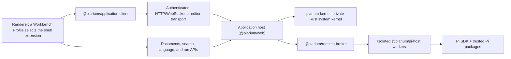

English | [简体中文](.github/readme/README.zh-CN.md) | [繁體中文](.github/readme/README.zh-TW.md) | [Français](.github/readme/README.fr.md) | [日本語](.github/readme/README.ja.md)

# Piarium

<p align="center">
  <picture>
    <source media="(prefers-color-scheme: dark)" srcset="packages/web/public/logo-dark-512x512.svg" />
    
  </picture>
</p>

[](https://github.com/Youzini-afk/Piarium/actions/workflows/ci.yml)
[](https://github.com/Youzini-afk/Piarium/actions/workflows/docker.yml)
[](LICENSE)

**A Pi-native, recomposable workspace and governed agent harness for coding agents: built for
local work and usable across desktop, web, editors, and mobile clients.**

Piarium turns the [Pi coding agent](https://github.com/earendil-works/pi) into a complete product.
Pi stays the agent kernel — model and provider stack, session tree, package manager, and extension
model — while Piarium owns everything around it: the tool environment, working state, recovery,
retrieval, context policy, and task governance, plus the workbench surfaces the agent runs inside.
It uses Pi's public SDK directly rather than scraping a terminal UI.

Its interface is not a fixed shell. Piarium ships two first-party working shapes — an **Agent
Workspace** centered on sessions, tasks, and context, and an **IDE Workbench** centered on editors,
search, Git, diagnostics, and debugging with the agent as a dockable panel — and both are ordinary
Piarium extensions selected by a Workbench Profile, so you can replace either one or any individual
part of it.

> [!IMPORTANT]
> Piarium is pre-1.0 and under active development. Product surfaces and the private runtime protocol
> currently advance together, so older builds are not guaranteed to interoperate with newer ones.
> Back up important workspaces and pin a tested image digest for persistent deployments.

## Product surfaces

The screenshots below use an isolated `demo-workspace` with anonymous sample files and no personal
accounts, projects, conversations, or credentials.

### Agent Workspace

Sessions and projects stay visible while the main canvas keeps the active agent, context tools, and
composer in one focused workspace.


### IDE Workbench

The IDE profile combines workspace navigation and editor infrastructure with a docked, fully capable
Pi agent instead of treating chat as a separate application.


### Mobile workspace

The responsive workspace keeps the same project, agent controls, context surfaces, and composer on a
phone-sized screen.

<p align="center">
  
</p>

## What Piarium provides

### A governed agent harness

- **Threads, runs, and immutable working state:** work is organized into threads and runs whose
  file changes publish as immutable roots. Agents draft in isolated virtual or materialized
  workspaces and merge reviewed results back, instead of making loose edits to your checkout.
- **One permission gate:** a single `tool_call` confirmation covers harness tools, Pi built-ins,
  MCP tools, package tools, and nested-thread tools. Session grants stay scoped to the tool,
  action, workspace, paths, and network targets they were approved for.
- **Recovery that follows the agent:** the Host-owned recovery service journals agent mutations
  alongside your own edits into combined checkpoints, so affected-file rollback, undo/redo, and
  crash recovery work across tool calls without scanning the whole workspace.
- **A native tool environment:** the shell supervisor runs real PTYs with automatic background
  promotion, `get_output`, `write_to_process`, and `kill_shell`; `edit`/`write`/`apply_patch` carry
  post-edit diagnostics and per-path leases; oversized results become paginated `OutputRef`s; and
  package-manager output is organized instead of dumped raw.

### Context, retrieval, and knowledge

- **Structured context assembly:** a Zone 2 layer injects observed workspace facts — your edits,
  terminal commands, diagnostics, Git status — without touching the system prompt. A memory keeper
  maintains durable memory in off/assist/takeover modes, and Host-side compaction can take over
  summarization without extra model calls.
- **Layered retrieval:** `grep` for exact match, `explore`/`related` for grouped discovery backed
  by a symbol graph and tree-sitter structure, and `recall` against a per-workspace knowledge store
  with optional embeddings and reranking. Each layer is reachable directly; none requires the
  others to fail first.
- **Native web tools:** `webfetch` with SSRF and domain policy, extraction, PDF, and caching;
  `websearch` through user-configured providers; a sources panel; and offscreen page rendering on
  the desktop surface.

### A real coding workspace

- **Pi-native conversations:** streaming, branching, tree navigation, compaction, steering and
  follow-up queues, model and thinking selection, session rename, archive, restore, and deletion.
- **Workspace tooling:** files, diffs, Git, worktrees, terminals, SSH hosts, remote instances,
  comments, and editor context share the active Pi session and workspace.
- **Editor-grade infrastructure:** one revisioned document authority with real conflict handling;
  desktop/Web Agent and IDE surfaces share Monaco models, editor groups, workspace search,
  host-owned language servers, and standards-conformant debug adapters, while mobile and embedded
  editors use a lightweight CodeMirror adapter against the same authority. Agent edits reconcile
  with your unsaved buffers instead of overwriting them.
- **Custom providers:** configure Pi-native provider layers, authentication, model discovery, and
  custom endpoints without mirroring credentials into renderer storage.

### Composable and everywhere

- **Packages without a parallel plugin system:** install, update, remove, and inspect any package
  accepted by Pi's `PackageManager`. Unknown extensions still receive generic command, tool, entry,
  notification, and UI handling.
- **First-class plugin configuration:** maintained plugins get focused GUI surfaces while their own
  native JSON/JSONC files, commands, databases, and migration logic remain authoritative.
- **A recomposable workbench:** pick the Agent or IDE profile, or build your own. Replace the whole
  shell or just the navigation, editor, panel, composer, timeline, or status bar, and mix first-party
  with community contributions. Switching happens live, without reloading documents, restarting the
  Pi runtime, or losing shared workspace state.
- **Multiple product surfaces:** a shared React UI powers Electron, Web, and the Capacitor mobile
  shell through explicit runtime capabilities, with VS Code as a companion that brings editor context
  to Piarium rather than a second workbench.
- **Cloud and remote operation:** authenticated WebSocket access, relay/tunnel support,
  multi-architecture containers, and atomic SSH deployment with health validation and rollback.

## Maintained extension integrations

Piarium does not fork Pi extensions or copy their private state. Maintained adapters consume each
extension's public commands, events, settings files, and capability contracts — including subagent
fleets, context managers, workspace history, MCP servers, web access, memory systems, background
tasks, and LSP/tooling configuration — so package updates can continue to advance independently.

See [maintained extension integration](docs/extension-compatibility.md) for the per-extension
command, event, and native-configuration contract, and which files stay plugin-owned. Piarium does
not certify plugin versions against Pi releases.

## Build Piarium extensions

Piarium application extensions and Pi packages are separate product objects: the former extend the
Piarium workbench, surfaces, and trusted Host, while the latter execute inside the Pi agent. The public
npm toolchain requires neither a Piarium source checkout nor imports from the product's private UI:

- `@piarium/extension-contract`: manifest, contribution, service, routing, and discovery contracts plus JSON Schema;
- `@piarium/extension-sdk`: framework-neutral Surface, isolated-realm, and Host authoring APIs;
- `@piarium/extension-react`: optional React 19 adapter;
- `@piarium/extension-surface`: lower-level lifecycle and registries for advanced tests or alternate hosts;
- `@piarium/extension-cli`: project initialization, validation, building, and conformance testing.

Create a complete extension project:

```sh
npx @piarium/extension-cli init ./my-extension --id dev.example.my-extension --name "My Extension"
cd my-extension
npm install
npx piarium-extension build
npx piarium-extension test
```

See the [Piarium extension authoring guide](docs/piarium-extension-authoring.md) for the complete
manifest, capability, lifecycle, storage, publishing, and testing contracts.

## Download Desktop

Windows x64/ARM64, Linux x64/ARM64, and macOS Intel/Apple Silicon desktop packages are published
through [GitHub Releases](https://github.com/Youzini-afk/Piarium/releases).

## Get started from source

### Prerequisites

- Node.js 22.19 or newer; Node.js 24 is the supported source-development baseline
- Bun 1.3.14
- A Rust toolchain matching `kernel/rust-toolchain.toml` (rustup selects it automatically)
- Git
- Git for Windows and Git Bash when running Pi shell tools on Windows

The Rust system kernel is a required runtime component, not an optional accelerator. Source
development runs it through Cargo when no staged binary is present; `bun run kernel:build` produces
the manifest-verified release executable that packaged layouts require.

Piarium ships a bundled Pi runtime and discovers user-level Pi installations through the Runtime
Manager, which can select, install, or upgrade Pi without downgrading it. Piarium becomes ready only
after a real Host handshake and does not need to restart after activation. Electron contains the
Node runtime needed to run the application, while Pi remains an independently managed tool. Native
x64/ARM64 desktop packages for Windows, Linux, and macOS are validated on matching runners for
application startup, Runtime Manager, health, and terminal lifecycle; optional offline installers
remain future work. Containers and the VS Code extension keep a pinned, self-contained Pi runtime
for reproducible unattended and editor-host execution.

### Run the Web development surface

```bash
git clone https://github.com/Youzini-afk/Piarium.git
cd Piarium
bun install --frozen-lockfile
bun run dev
```

Open the Vite URL printed in the terminal. Piarium selects available development ports and starts
the trusted API/runtime service alongside the UI.

### Run the desktop application

```bash
bun run electron:dev
```

Use the bundled-assets path when testing behavior closer to a packaged build:

```bash
bun run electron:dev:bundled
```

### Build a Windows installer

Run this on Windows:

```powershell
bun run electron:build:win
bun run electron:smoke:win
```

The NSIS installer, update metadata, and blockmap are written to `packages/electron/dist`. Without
code-signing credentials the installer is intentionally unsigned. See the
[desktop packaging guide](packages/electron/README.md#packaging) for signing and platform details.

## Run the cloud image

The Compose file uses the slim image `ghcr.io/youzini-afk/piarium-slim:latest` by default. On a Linux
Docker host:

```bash
mkdir -p data/piarium data/ssh data/cloudflared workspaces
sudo chown -R 1000:1000 data workspaces
umask 077
printf 'PIARIUM_UI_PASSWORD=%s\n' "$(openssl rand -base64 24)" > .env
docker compose up -d
curl --fail http://127.0.0.1:3000/health
```

Open `http://127.0.0.1:3000` and use the generated password. Put a TLS reverse proxy or an approved
tunnel in front of any Internet-facing deployment; see [reverse proxy setup](docs/REVERSE_PROXY.md)
for the required forwarding rules. For production, set `PIARIUM_IMAGE` to a tested immutable digest
instead of relying on a floating tag.

If the agent needs to compile Python, Java, Go, or Rust inside the container, apply the toolbelt
overlay:

```bash
docker compose -f docker-compose.yml -f docker-compose.toolbelt.yml up -d
```

Images are published for `linux/amd64` and `linux/arm64` with provenance and SBOM attestations. The
complete persistent-path, environment, container, and SSH rollback contract is documented in
[Cloud deployment](docs/cloud-deployment.md).

## Architecture



The application host is the single trusted backend. Each host owns a private `piarium-kernel` child
process that is the production authority for durable and machine-adjacent resources: immutable
working-state roots, content objects and GC, recovery metadata, canonical file resources and
materialization, PTY and pipe process trees, and fixed-view file and structure computation. The host
keeps product policy — actor admission, document coordination, thread and run lifecycle, knowledge,
and model orchestration — and talks to the kernel over a private framed stdio protocol, never a
public port. There is exactly one production writer per resource; no TypeScript fallback authority
remains behind the kernel.

The broker owns a catalog worker plus per-session workers. A renderer reload does not terminate an
active task, and a Pi worker failure does not crash the renderer. Protocol DTOs cross the process
boundary; SDK callbacks, credential objects, and extension implementation details do not.

Electron runs that same host in its main process rather than adding a parallel desktop backend; only
native capability such as windows, menus, and dialogs crosses the Electron preload boundary.

Third-party Pi packages are executable code with the user's operating-system permissions. Piarium
shows observed capabilities and gates project-local executable resources, but it does not claim to
turn trusted extensions into a complete sandbox. Read the [security policy](.github/SECURITY.md) and
[security model](docs/security.md) before exposing a remote instance or installing unfamiliar code.

## Repository layout

| Path | Responsibility |
| --- | --- |
| `kernel/` | Private Rust system kernel: working state, file resources, processes, and compute |
| `packages/application-client` | Framework-neutral `RuntimeAPIs`, transports, typed failures, and the desktop IPC contract |
| `packages/ui` | Shared Pi-native React UI, stores, settings, and extension surfaces |
| `packages/web` | Browser/remote frontend, trusted Application Host, and cloud CLI |
| `packages/electron` | Native desktop shell, privileged boundary, packaging, SSH, and updates |
| `packages/vscode` | VS Code extension host, webview, and runtime bridge |
| `packages/mobile` | Capacitor iOS/Android shell connected to a Piarium server |
| `packages/protocol` | Versioned, JSON-safe worker and surface protocol |
| `packages/runtime-client` | Browser-safe runtime request/event client |
| `packages/runtime-broker` | Catalog/session worker ownership, routing, and shutdown |
| `packages/pi-host` | Isolated Node worker embedding the Pi SDK and extensions |
| `packages/settings-store` | Atomic settings-file persistence shared by the hosts |
| `packages/extension-contract` | Manifest, contribution, workbench, service, and discovery contracts |
| `packages/extension-surface` | Framework-neutral owner scopes and transactional Surface registries |
| `packages/extension-sdk`, `-react`, `-cli` | Public authoring SDK, React adapter, and author tooling |
| `packages/extension-host` | Trusted application-host catalog, artifacts, storage, and services |
| `packages/extension-loader` | Authenticated managed Surface module loader and isolated realms |
| `packages/extension-builtins` | Manifests for Piarium's built-in extensions, including both shells |
| `packages/docs` | User-facing documentation site source |
| `docs` | Architecture, harness, kernel, workbench, migration, recovery, cloud, and security contracts |
| `scripts` | Development, kernel build/measurement, release, cloud, deployment, and validation tooling |

## Development and validation

Use root or package `package.json` scripts as the command source of truth. The broad local baseline
matches the important CI gates:

```bash
bun install --frozen-lockfile
bun run type-check
bun run lint
bun run test:pi
bun run test:kernel
bun run test:cloud
bun run build
bun run test:pi:dist
```

`bun run kernel:check` is the fast Rust compile check; `bun run test:kernel` runs the non-skipping
native authority suite against the built release executable. `bun run test:docs` and
`bun run docs:validate` check engineering and docs-site content.

CI exposes three stable gates with distinct responsibilities: Ubuntu source quality, Windows runtime
behavior, and the Ubuntu production build. Type checking, lint, and the full workspace tests run once
in their authoritative gate; Windows adds only platform-sensitive coverage. Changes to cloud/runtime
inputs make the Docker workflow verify the container contract, build the coupled slim and toolbelt
base/application images, smoke both applications by immutable digest, and promote tags only after
both candidates pass.

Before contributing, read [CONTRIBUTING.md](.github/CONTRIBUTING.md), the repository-specific rules in
[AGENTS.md](AGENTS.md), and the [engineering guide](docs/development.md).

## Design and operations documentation

- [Architecture](docs/architecture.md)
- [Engineering guide](docs/development.md)
- [Roadmap](docs/roadmap.md)
- [Agent harness contract](docs/agent-harness.md) (Chinese), with [delivery status](docs/agent-harness-status.md), [plan](docs/agent-harness-plan.md), and [decision log](docs/agent-harness-decisions.md)
- [Rust system kernel design](docs/rust-kernel-design.md) and [audit record](docs/rust-kernel-audit.md)
- [Composable workbench and IDE contract](docs/composable-workbench.md) (Chinese)
- [Unified file editor platform](docs/unified-file-editor-platform.md)
- [Piarium extension platform](docs/piarium-extension-platform.md)
- [VS Code companion migration](docs/vscode-companion.md)
- [OpenChamber-to-Pi migration contract](docs/openchamber-pi-migration.md)
- [Plugin GUI and ownership design](docs/plugin-gui-design.md)
- [Recovery model](docs/recovery.md)
- [Cloud deployment](docs/cloud-deployment.md)
- [Security model](docs/security.md)

- Thanks to the [LinuxDO](https://linux.do) community for their support

## Lineage and license

Piarium is a Pi-native refactor of the maintainer's OpenChamber fork.

Piarium as a combined work is distributed under the
[GNU Affero General Public License v3.0](LICENSE) (`AGPL-3.0-only`). Modified versions offered to
users over a network must make their corresponding source available as required by the license.
