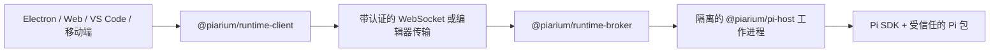

[English](README.md) | 简体中文

# Piarium

[](https://github.com/Youzini-afk/Piarium/actions/workflows/ci.yml)
[](https://github.com/Youzini-afk/Piarium/actions/workflows/docker.yml)
[](LICENSE)

**一个 Pi 原生的编程智能体工作空间：以本地和桌面体验为中心，同时覆盖 Web、编辑器与移动端。**

Piarium 将 [Pi 编程智能体](https://github.com/earendil-works/pi)扩展为一套完整的产品工作空间。
它直接使用 Pi 的公开 SDK、会话树、包管理器和扩展模型，不抓取终端输出，也不保留永久的
OpenCode 兼容层。

> [!IMPORTANT]
> Piarium 目前仍处于 1.0 之前的活跃开发阶段。各产品端和私有运行时协议会同步演进，较旧构建
> 不保证与较新构建互通。请备份重要工作区；长期部署时，请固定到已经验证的镜像摘要。

## Piarium 提供什么

- **Pi 原生会话：** 支持流式响应、分支、会话树导航、压缩、引导和后续消息队列、模型与思考
  级别选择，以及会话重命名、归档、恢复和删除。
- **真正的编程工作空间：** 文件、Diff、Git、工作树、终端、SSH 主机、远程实例、代码评论和
  编辑器上下文，共享当前 Pi 会话及其工作目录。
- **不另造一套插件系统：** 可以安装、更新、移除和检查 Pi `PackageManager` 接受的任意包。
  尚未专门适配的扩展仍可使用通用的命令、工具、条目、通知和 UI 桥接。
- **常用插件的专用配置界面：** 已维护的插件拥有针对性的 GUI，同时继续以插件自己的原生
  JSON/JSONC 文件、命令、数据库和迁移逻辑为权威。
- **由插件提供的恢复能力：** 对话回退沿用 Pi 的追加式会话树；对话与文件联合恢复、检查点、
  撤销/重做和提示词修复，则委托给真正拥有相应历史的插件。
- **自定义提供商：** 配置 Pi 原生的提供商分层、认证、模型发现和自定义端点，不把凭据复制到
  渲染进程存储中。
- **多个产品端：** Electron、Web、VS Code 和 Capacitor 移动端外壳共享一套 React UI，并通过
  明确的运行时能力与宿主通信。
- **云端与远程运行：** 支持带认证的 WebSocket、Relay/隧道、多架构容器，以及经过健康检查和
  可回滚的原子 SSH 部署。

## 已维护的扩展集成

Piarium 不会 fork 这些扩展，也不会复制它们的私有状态。集成只依赖插件公开的 Pi 命令、事件、
设置文件和能力协议，因此插件可以继续独立更新。

| 扩展 | Piarium 集成 |
| --- | --- |
| `pi-subagents` | 通过插件公开的 RPC 和命令展示并控制 Fleet/任务树 |
| `@cortexkit/pi-magic-context` | 原生用户/项目 JSONC 配置、已注册命令、状态和公开条目 |
| `pi-workspace-history` | 对话与工作区联合恢复、撤销、重做和命名检查点 |
| `pi-wtf` | 提示词修复操作和插件自有的 `wtf.json` 配置 |
| `pi-mcp-adapter` | 插件计算的有效服务目录、公开状态与操作，以及带版本校验的原生配置来源编辑 |
| `pi-web-access` | 原生 `web-search.json`、Curator 与账号操作、已保存结果导航 |

当前验证过的版本和具体证据见[扩展兼容性记录](docs/extension-compatibility.md)。

## 从源码开始

### 环境要求

- Node.js 22.19 或更高版本；Node.js 24 是当前支持的开发基线
- Bun 1.3.14
- Git
- 在 Windows 上运行 Pi shell 工具时，需要 Git for Windows 和 Git Bash

打包后的桌面端和容器已经包含固定版本的 Pi 运行时。使用桌面安装包的最终用户无需另行安装
Pi CLI 或 Node.js。

### 运行 Web 开发环境

```bash
git clone https://github.com/Youzini-afk/Piarium.git
cd Piarium
bun install --frozen-lockfile
bun run dev
```

打开终端输出的 Vite 地址。Piarium 会选择可用的开发端口，并同时启动 UI 与可信 API/运行时服务。

### 运行桌面应用

```bash
bun run electron:dev
```

需要测试更接近安装包的内置资源模式时，运行：

```bash
bun run electron:dev:bundled
```

### 构建 Windows 安装包

请在 Windows 上运行：

```powershell
bun run electron:build:win
bun run electron:smoke:win
```

NSIS 安装包、更新元数据和 blockmap 会输出到 `packages/electron/dist`。没有配置代码签名凭据时，
构建会有意生成未签名安装包。签名方式和其他平台说明见
[桌面打包指南](packages/electron/README.md#packaging)。

## 运行云端镜像

Compose 默认使用 `ghcr.io/youzini-afk/piarium:latest`。在 Linux Docker 主机上运行：

```bash
mkdir -p data/piarium data/ssh data/cloudflared workspaces
sudo chown -R 1000:1000 data workspaces
umask 077
printf 'PIARIUM_UI_PASSWORD=%s\n' "$(openssl rand -base64 24)" > .env
docker compose up -d
curl --fail http://127.0.0.1:3000/health
```

打开 `http://127.0.0.1:3000`，使用刚生成的密码登录。任何面向公网的部署都应置于 TLS 反向代理
或经过审核的隧道之后。生产环境请将 `PIARIUM_IMAGE` 固定为已验证的不可变摘要，不要依赖浮动标签。

镜像同时发布 `linux/amd64` 和 `linux/arm64` 版本，并带有 provenance 与 SBOM 证明。持久化路径、
环境变量、容器及 SSH 回滚的完整约定见[云端部署](docs/cloud-deployment.md)。

## 架构



Broker 管理一个目录工作进程和每个会话各自的工作进程。渲染器重新加载不会终止正在执行的任务，
Pi 工作进程异常也不会让渲染器一同崩溃。跨进程传输的是 Piarium 协议 DTO；SDK 回调、凭据对象和
扩展实现细节不会越过这条边界。

第三方 Pi 包是拥有当前用户操作系统权限的可执行代码。Piarium 会展示观察到的能力，并对项目内
可执行资源设置授权门槛，但不会把受信任扩展宣传成完整的沙箱。在公开远程实例或安装陌生代码之前，
请阅读[安全策略](SECURITY.zh-CN.md)和[安全模型](docs/security.md)。

## 仓库结构

| 路径 | 职责 |
| --- | --- |
| `packages/ui` | 共享的 Pi 原生 React UI、状态、设置和扩展界面 |
| `packages/web` | 浏览器/远程前端、HTTP/WebSocket 服务和云端 CLI |
| `packages/electron` | 原生桌面外壳、特权边界、打包、SSH 和更新 |
| `packages/vscode` | VS Code 扩展宿主、Webview 和运行时桥接 |
| `packages/mobile` | 连接 Piarium 服务端的 Capacitor iOS/Android 外壳 |
| `packages/protocol` | 带版本且可安全 JSON 序列化的工作进程/产品端协议 |
| `packages/runtime-client` | 可在浏览器中使用的运行时请求/事件客户端 |
| `packages/runtime-broker` | 目录/会话工作进程的管理、路由和关闭 |
| `packages/pi-host` | 嵌入 Pi SDK 和扩展的隔离 Node 工作进程 |
| `packages/docs` | 面向用户的文档站源码 |
| `docs` | 架构、迁移、恢复、插件、云端和安全约定 |
| `scripts` | 开发、发布、云端构建、部署和校验工具 |

## 开发与校验

以根目录或各包的 `package.json` 脚本为准。下面这组本地基线覆盖 CI 的主要质量门槛：

```bash
bun install --frozen-lockfile
bun run type-check
bun run lint
bun run check:pi
bun run test:cloud
bun run build
bun run test:pi:dist
```

CI 会在 Windows 和 Ubuntu 上分别运行。云端/运行时输入发生变化时，还会构建配套的运行时基础镜像
与应用镜像，通过不可变摘要启动候选镜像并完成烟测后，才会提升可安装标签。

参与贡献前，请阅读[贡献指南](CONTRIBUTING.zh-CN.md)和仓库专用规则 [AGENTS.md](AGENTS.md)。

## 设计与运维文档

- [架构](docs/architecture.md)
- [路线图](docs/roadmap.md)
- [从 OpenChamber 迁移到 Pi 的约定](docs/openchamber-pi-migration.md)
- [插件 GUI 与状态归属设计](docs/plugin-gui-design.md)
- [恢复模型](docs/recovery.md)
- [云端部署](docs/cloud-deployment.md)
- [安全模型](docs/security.md)

## 项目沿革与许可证

Piarium 是维护者 OpenChamber fork 的直接 Pi 原生重构。该 fork 是产品和 UI 的来源，不是运行时
依赖：随着 Pi 原生实现成为权威，过时的 OpenCode 进程、客户端、Schema 和兼容路径会被删除。

Piarium 作为组合后的完整作品，按照
[GNU Affero General Public License v3.0](LICENSE)（`AGPL-3.0-only`）发布。通过网络向用户提供
修改版时，必须按照许可证要求向这些用户提供对应源码。

导入的宽松许可证代码仍保留其原始声明；保留这些声明不代表 Piarium 整体仍可按 MIT License 使用。
详情见[第三方声明](THIRD_PARTY_NOTICES.md)。Pi 和第三方 Pi 包是独立项目，并分别遵循它们自己的
许可证。
